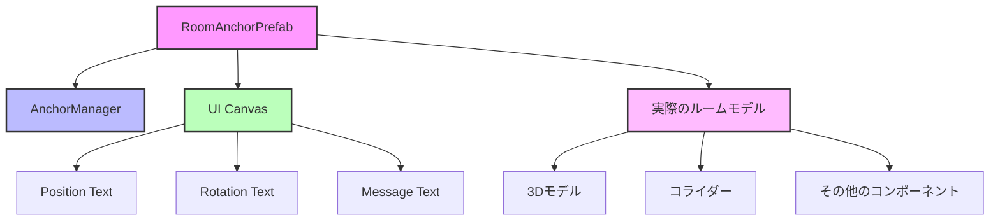

XR開発をされているみなさん．ある部屋の中でVR(仮想現実)とMR(複合現実)の位置を合わせるってこと，非常に重要．例えばMRの場合，ユーザーがヘッドセットを外して再度装着した後でも, 仮想オブジェクトが元の現実世界の位置に表示されることが可能になるようにしないと，ユーザーが混乱しますね．また，MR空間とVR空間を繋げる場合，VR空間の位置をMR空間の位置に合わせる必要があり，MR空間であり得ない位置に仮想オブジェクトが表示される場合大変なことになるでしょう．

このような場合にSpatial Anchorは非常に重要な役割を果たします．

## Spatial Anchorとは

Spatial Anchor（空間アンカー）は, 現実世界の特定の位置と向きを記録し, その情報を元に仮想オブジェクトを配置するための技術である. Meta Questデバイスでは, OVRSpatialAnchorコンポーネントを使用して実装される. この技術により, ユーザーがVRヘッドセットを外して再度装着した後でも, 仮想オブジェクトが元の現実世界の位置に表示されることが可能になる.

Spatial Anchorの主な特徴は以下の通りである:

1. **持続性**: セッション間でオブジェクトの位置を維持できる
2. **精度**: 現実世界の基準点に対して高精度な位置合わせが可能
3. **共有**: 複数のデバイス間でアンカー情報を共有することができる
4. **保存**: アンカー情報をローカルまたはクラウドに保存できる

(参考)
Meta XR SDK(V66-74)でQuestアプリを開発

https://www.docswell.com/s/Ovjang/ZP9V6X-MetaXRSDK66#p340

## 実装方法

### 基本的な設定

Meta XR SDKでSpatial Anchorを利用するための基本的な設定手順は以下の通りである:

1. Meta XR SDKをUnityプロジェクトにインポートする
2. OVRManagerを設定し, Tracking Originを「Floor Level」に設定する
3. OVRSceneManagerコンポーネントをシーンに追加する
4. 必要なスクリプトリファレンスを追加する（`using Oculus.Interaction.Input`など）

### AnchorManagerの実装とUI構成

AnchorManagerは、Spatial Anchorの作成、保存、読み込み、編集などの機能を統合的に管理するコンポーネントである。以下に、実装の詳細と推奨されるPrefab構造について説明する。

#### Prefabの階層構造



#### コンポーネントの設定

1. **RoomAnchorPrefab（親オブジェクト）**
   - このPrefabが空間アンカーの基準点となる
   - 位置と回転の調整が容易になるよう、原点に配置することを推奨

2. **AnchorManager**(下の見出しで全文記載します)
   ```csharp
   public class AnchorManager : MonoBehaviourPunCallbacks
   {
       [SerializeField] private TextMeshProUGUI _message;
       [SerializeField] private TextMeshProUGUI _textPosition;
       [SerializeField] private TextMeshProUGUI _textRotation;
       // ... 他のフィールド
   }
   ```
   - RoomAnchorPrefabにアタッチする
   - UIテキストコンポーネントへの参照を保持
   - Spatial Anchorの操作機能を提供

3. **UI Canvas**
   ```mermaid
   graph TD
    A[Canvas] --> B[Position Panel]
    A --> C[Rotation Panel]
    A --> D[Message Panel]
    B --> E[Position Text]
    C --> F[Rotation Text]
    D --> G[Message Text]

    style A fill:#bfb,stroke:#333,stroke-width:2px
    style B fill:#dfd,stroke:#333,stroke-width:2px
    style C fill:#dfd,stroke:#333,stroke-width:2px
    style D fill:#dfd,stroke:#333,stroke-width:2px
   ```

#### UIの実装手順

1. **Canvas設定**
   ```
   - Render Mode: World Space
   - Scale: 0.001 (VR空間に適したスケール)
   - Sort Order: 適切な値を設定
   ```

2. **テキストコンポーネントの配置**
   ```
   Position Text:
   - フォントサイズ: 14
   - アンカー: 左上
   - カラー: 見やすい色（白など）

   Rotation Text:
   - フォントサイズ: 14
   - アンカー: 左上
   - カラー: 見やすい色（白など）

   Message Text:
   - フォントサイズ: 16
   - アンカー: 中央上
   - カラー: 目立つ色（黄色など）
   ```

#### 操作方法の実装

AnchorManagerは以下のボタン操作をサポートする：

```csharp
void Update()
{
    // 位置情報の更新
    Vector3 pos = gameObject.transform.position;
    Vector3 rot = gameObject.transform.eulerAngles;
    _textPosition.text = pos.ToString();
    _textRotation.text = rot.ToString();

    // ボタン操作
    if (OVRInput.GetDown(OVRInput.Button.One))    // Aボタン
        OnSaveLocalButtonPressed();                // ローカル保存
    if (OVRInput.GetDown(OVRInput.Button.Two))    // Bボタン
        CreateAnchor();                           // アンカー作成
    if (OVRInput.GetDown(OVRInput.Button.Three))  // Xボタン
        OnDeleteLocalButtonPressed();             // アンカー削除
    if (OVRInput.GetDown(OVRInput.Button.Four))   // Yボタン
        OnLoadLocalButtonPressed();               // ローカルから読み込み
}
```

#### アンカー操作モードの切り替え

アンカーには2つの操作モードがある：

1. **固定モード（デフォルト）**
   - アンカーが空間に固定される
   - 位置の変更不可

2. **編集モード**
   - アンカーの位置を自由に変更可能
   - 以下のコードで切り替え：

```csharp
public void ToggleEditMode()
{
    if (!_spatialAnchor) return;

    if (_spatialAnchor.enabled)
    {
        // 編集モードに切り替え
        _spatialAnchor.enabled = false;
        _message.text = "Edit mode: Object can be moved";
    }
    else
    {
        // 固定モードに切り替え
        _spatialAnchor.enabled = true;
        _message.text = "Fixed mode: Object is anchored";
    }
}
```

#### 実際のモデルの配置

1. **モデルのインポート**
   - FBX/glTFなどの3Dモデルをプロジェクトにインポート
   - 適切なスケールとマテリアルを設定

2. **Prefabへの追加**
   ```
   RoomAnchorPrefab(AnchorManagerがコンポーネントとしてアタッチされている)
   ├── UI Canvas
   └── RoomModel（実際のモデル）
       ├── MeshRenderer
       ├── Collider
       └── その他必要なコンポーネント
   ```

3. **位置調整**
   - モデルの原点がアンカーポイントと一致するように配置
   - スケールは1:1になるように調整


## AnchorManager全文

以下に、AnchorManagerの完全な実装コードを示す：

```csharp
using System;
using System.Collections;
using System.Collections.Generic;
using System.Text;
using Cysharp.Threading.Tasks;
using TMPro;
using UnityEngine;
using Photon.Pun;

public class AnchorManager : MonoBehaviourPunCallbacks
{
    private OVRSpatialAnchor _spatialAnchor;
    private System.Guid _uuid;
    [SerializeField]
    private TextMeshProUGUI _message;
    [SerializeField]
    private TextMeshProUGUI _textPosition;
    [SerializeField]
    private TextMeshProUGUI _textRotation;
    public bool isCreated { get; private set; }
    private bool _isSaved;
    [SerializeField]
    private string _uniqueKey;
    public GameObject roomPrefab;

    public delegate void AnchorLoadedCallback();
    public event AnchorLoadedCallback OnAnchorLoaded;
    [SerializeField] private SoundPlayer _loadFinSE;

    void Start()
    {
        // 必要なコンポーネントの存在確認
        if (_message == null || _textPosition == null || _textRotation == null)
        {
            Debug.LogError("Required UI components are not set");
            enabled = false;
            return;
        }
    }

    void Update()
    {
        // 位置情報の更新
        Vector3 pos = gameObject.transform.position;
        Vector3 rot = gameObject.transform.eulerAngles;
        _textPosition.text = pos.ToString();
        _textRotation.text = rot.ToString();

        // ボタン操作(デバッグ用)
        if (OVRInput.GetDown(OVRInput.Button.One))    // Aボタン
            FinalizeAnchor();               // ローカル保存
        if (OVRInput.GetDown(OVRInput.Button.Two))    // Bボタン
            CreateAnchor();                           // アンカー作成
        if (OVRInput.GetDown(OVRInput.Button.Three))  // Xボタン
            OnDeleteLocalButtonPressed();             // アンカー削除
        if (OVRInput.GetDown(OVRInput.Button.Four))   // Yボタン
            OnLoadLocalButtonPressed();               // ローカルから読み込み

        // Editモード切り替え(モデルが操作できるようにする)
        if (OVRInput.GetDown(OVRInput.Button.PrimaryThumbstick))
            ToggleEditMode();

        // 最終確定(CreateしてSaveする)
        if (OVRInput.GetDown(OVRInput.Button.SecondaryThumbstick))
            FinalizeAnchor();
    }

    public async void CreateAnchor()
    {
        try
        {
            var token = this.GetCancellationTokenOnDestroy();

            // Anchorの作成
            _message.text = "Start creating the anchor....";
            // コンポーネントが既にあれば削除
            if (_spatialAnchor)
            {
                Destroy(_spatialAnchor);
            }
            _spatialAnchor = gameObject.AddComponent<OVRSpatialAnchor>();
            // Anchorの作成待ち(※UniTask使用)
            await UniTask.WaitUntil(() => !_spatialAnchor || _spatialAnchor.Created);

            if (_spatialAnchor)
            {
                // 作成に成功したらuuidを保管する
                _uuid = _spatialAnchor.Uuid;
                _message.text = "Successfully created anchor.";
                isCreated = true;
            }
            else
            {
                _message.text = "Failed to create anchor.";
                isCreated = false;
            }
        }
        catch (Exception e)
        {
            _message.text = $"Error: {e.Message}";
            Debug.LogError($"Anchor creation failed: {e}");
        }
    }

    public void OnDeleteLocalButtonPressed()
    {
        // 作られていない時は削除しない
        if (!_spatialAnchor) return;
        _message.text = "deleting...";
        _spatialAnchor.Erase((anchor, success) =>
        {
            if (success)
            {
                _message.text = "Successfully deleted anchor.";
                // PlayerPrefsからも削除
                PlayerPrefs.DeleteKey(_uniqueKey);
            }
            else
            {
                _message.text = "Failed to delete anchor.";
            }
            isCreated = false;
        });
    }

    public async void OnSaveLocalButtonPressed()
    {
        if (!_spatialAnchor) return;
        _message.text = "Saving to local...";

        // アンカーをローカルに保存
        var saveOptions = new OVRSpatialAnchor.SaveOptions();
        saveOptions.Storage = OVRSpace.StorageLocation.Local;
        _spatialAnchor.Save(saveOptions, (anchor, success) =>
        {
            if (success)
            {
                _isSaved = true;
                _message.text = "Successfully saved anchor to local.";

                // ローカルにUUIDを保存
                string anchorUUID = anchor.Uuid.ToString();
                Debug.Log("Saving Anchor UUID to PlayerPrefs: " + anchorUUID);
                PlayerPrefs.SetString(_uniqueKey, anchorUUID);
                PlayerPrefs.Save();
            }
            else
            {
                _isSaved = false;
                _message.text = "Failed to save anchor to local.";
                return;
            }
        });
    }

    public void OnLoadLocalButtonPressed()
    {
        string savedUuid = "";

        // PlayerPrefsからUUIDを取得
        savedUuid = PlayerPrefs.GetString(_uniqueKey, "");
        Debug.Log("Trying to load from PlayerPrefs with key " + _uniqueKey + ": " + savedUuid);

        if (string.IsNullOrEmpty(savedUuid))
        {
            _isSaved = false;
            _message.text = "No stored local anchor UUID found.";
            Debug.LogWarning("No stored local anchor UUID found.");
            return;
        }

        // ステータスをリセット
        isCreated = false;

        try
        {
            // Load Optionの作成
            var uuids = new Guid[1] { new Guid(savedUuid) };
            var loadOptions = new OVRSpatialAnchor.LoadOptions
            {
                Timeout = 0,
                StorageLocation = OVRSpace.StorageLocation.Local,
                Uuids = uuids
            };
            LoadAnchors(loadOptions);
            _loadFinSE.Play();
        }
        catch (System.Exception e)
        {
            _message.text = "Error loading anchor: " + e.Message;
            Debug.LogError("Error loading anchor: " + e.Message);
        }
    }

    private void LoadAnchors(OVRSpatialAnchor.LoadOptions options)
    {
        // ローカルからアンカーをUUIDを指定して読み込み
        _message.text = "Loading anchor from local...";
        Debug.Log("Loading anchor from local...");
        OVRSpatialAnchor.LoadUnboundAnchors(options, anchors =>
        {
            if (anchors.Length != 1)
            {
                // アンカーが読めなかった
                _message.text = "Failed to load anchor from local.";
                Debug.LogError("Failed to load anchor from local.");
                return;
            }
            if (anchors[0].Localized)
            {
                // すでにローカライズが終了していた場合
                OnLocalized(anchors[0], true);
                Debug.Log("Anchor is already localized.");
            }
            else if (!anchors[0].Localizing)
            {
                // 空間マッピングが不十分などの理由でローカライズに失敗している場合、再度ローカライズ
                anchors[0].Localize(OnLocalized);
                Debug.Log("Localizing anchor...");
            }
        });
    }

    private void OnLocalized(OVRSpatialAnchor.UnboundAnchor unboundAnchor, bool success)
    {
        if (!success)
        {
            // アンカーが読めなかった
            _message.text = "Failed to load anchor.";
            return;
        }
        // アンカーのGame Objectを読み取った位置に移動し、アンバインドのアンカーをコンポーネントにバインドする
        var pose = unboundAnchor.Pose;
        transform.SetPositionAndRotation(pose.position, pose.rotation);
        if (!_spatialAnchor)
        {
            _spatialAnchor = gameObject.AddComponent<OVRSpatialAnchor>();
        }
        unboundAnchor.BindTo(_spatialAnchor);
        _message.text = "Successfully loaded anchor from local.";
        Debug.Log("Successfully loaded anchor from local.");
        isCreated = true;

        // アンカーが正常に読み込まれたことをコールバックで通知
        OnAnchorLoaded?.Invoke();
    }

    public void ToggleEditMode()
    {
        if (!_spatialAnchor) return;

        if (_spatialAnchor.enabled)
        {
            // 編集モードにする
            _spatialAnchor.enabled = false;

            // TODO: この際に別ファイルでQuestのスティックやgrabbableを用いてアンカー(モデル)を移動できるようにする
            
            _message.text = "Edit mode: Object can be moved";
        }
        else
        {
            // 再度固定する
            _spatialAnchor.enabled = true;
            _message.text = "Fixed mode: Object is anchored";
        }
    }

    public void FinalizeAnchor()
    {
        if (!_spatialAnchor) return;

        // まず現在位置にアンカーを再作成
        Destroy(_spatialAnchor);
        CreateAnchor();

        // 作成後保存
        OnSaveLocalButtonPressed();
    }

    public void OnResetRotXButtonPressed()
    {
        float rotY = gameObject.transform.eulerAngles.y;
        float rotZ = gameObject.transform.eulerAngles.z;
        gameObject.transform.rotation = Quaternion.Euler(new Vector3(0, rotY, rotZ));
    }

    public void OnResetRotYButtonPressed()
    {
        float rotX = gameObject.transform.eulerAngles.x;
        float rotZ = gameObject.transform.eulerAngles.z;
        gameObject.transform.rotation = Quaternion.Euler(new Vector3(rotX, 0, rotZ));
    }

    public void OnResetRotZButtonPressed()
    {
        float rotX = gameObject.transform.eulerAngles.x;
        float rotY = gameObject.transform.eulerAngles.y;
        gameObject.transform.rotation = Quaternion.Euler(new Vector3(rotX, rotY, 0));
    }

    public void OnRotYButtonPressed()
    {
        float rotX = gameObject.transform.eulerAngles.x;
        float rotY = gameObject.transform.eulerAngles.y;
        float rotZ = gameObject.transform.eulerAngles.z;
        gameObject.transform.rotation = Quaternion.Euler(new Vector3(rotX, rotY+45f, rotZ));
    }

    // 外部からアンカーロード処理を呼び出せるパブリックメソッド
    public void LoadAnchorFromExternal()
    {
        OnLoadLocalButtonPressed();
    }

    // アンカーの位置と回転を取得するメソッド
    public Transform GetAnchorTransform()
    {
        if (_spatialAnchor && isCreated)
        {
            return transform;
        }
        return null;
    }
}
```

このコードには以下の主要な機能が含まれている：

1. アンカーの作成・削除
2. ローカルストレージへの保存・読み込み
3. 位置・回転の制御
4. 編集モードの切り替え
5. エラーハンドリング
6. UIテキストの更新
7. コントローラー入力の処理

## 基本操作とMeta Quest 3での実行方法

### 基本操作

Spatial Anchorの基本操作は以下の4つ：

#### 1. アンカーの作成 (Create)

- **操作方法**: コントローラーのBボタンを押す
- **処理内容**:
  - 現在の位置にOVRSpatialAnchorコンポーネントを作成
  - 作成完了まで待機
  - 成功時にUUIDを保存
  - UIに作成状態を表示

```csharp
// アンカー作成の主要な処理
_spatialAnchor = gameObject.AddComponent<OVRSpatialAnchor>();
await UniTask.WaitUntil(() => !_spatialAnchor || _spatialAnchor.Created);
_uuid = _spatialAnchor.Uuid;
```

#### 2. アンカーの保存 (Save)

- **操作方法**: コントローラーのAボタンを押す
- **処理内容**:
  - アンカーをローカルストレージに保存
  - UUIDをPlayerPrefsに保存
  - 保存状態をUIに表示

```csharp
// ローカル保存の主要な処理
var saveOptions = new OVRSpatialAnchor.SaveOptions();
saveOptions.Storage = OVRSpace.StorageLocation.Local;
_spatialAnchor.Save(saveOptions, (anchor, success) => {
    // 成功時にUUIDをPlayerPrefsに保存
    PlayerPrefs.SetString(_uniqueKey, anchor.Uuid.ToString());
});
```

#### 3. アンカーの削除 (Delete)

- **操作方法**: コントローラーのXボタンを押す
- **処理内容**:
  - アンカーをローカルストレージから削除
  - PlayerPrefsからUUIDを削除
  - 削除状態をUIに表示

```csharp
// 削除の主要な処理
_spatialAnchor.Erase((anchor, success) => {
    if (success) {
        PlayerPrefs.DeleteKey(_uniqueKey);
    }
});
```

#### 4. アンカーの読み込み (Load)

- **操作方法**: コントローラーのYボタンを押す
- **処理内容**:
  - PlayerPrefsからUUIDを取得
  - ローカルストレージからアンカーを読み込み
  - ローカライズ処理の実行
  - 読み込み状態をUIに表示

```csharp
// 読み込みの主要な処理
string savedUuid = PlayerPrefs.GetString(_uniqueKey);
var uuids = new Guid[1] { new Guid(savedUuid) };
var loadOptions = new OVRSpatialAnchor.LoadOptions {
    StorageLocation = OVRSpace.StorageLocation.Local,
    Uuids = uuids
};
OVRSpatialAnchor.LoadUnboundAnchors(loadOptions, anchors => {
    // ローカライズ処理を実行
    anchors[0].Localize(OnLocalized);
});
```

### Meta Quest 3での実行手順

1. **ビルド**
   - Unityで開発したアプリケーションをビルド

2. **空間認識の準備**
   - Meta Quest 3を装着し、周囲の空間をスキャン(Metaの設定からも可能)
   - 十分な明るさと特徴のある環境であることを確認
   - 部屋の境界線を設定

3. **アンカー操作の実行**
   - アプリケーションを起動
   - コントローラーの**Bボタンでアンカーを作成**
   - 位置調整が必要な場合は左スティック(左スティックで動作するようにコードを書いた場合)を押してEdit Modeに切り替え
   - 調整後、**Aボタンで保存**
   - アプリケーションを再起動しても、Yボタンで保存した位置に読み込み可能

4. **注意点**
   - 空間認識が不十分な場合、ローカライズに失敗する可能性あり
   - 明るい環境で、特徴的な物体がある場所での使用を推奨
   - アンカー作成時は、デバイスをできるだけ安定させる
   - 編集モード中は位置が固定されないため、慎重に操作

これらの操作を組み合わせることで，空間内に永続的な基準点を設定し，アプリケーションの再起動後も同じ位置に仮想オブジェクトを配置することが可能になる．
