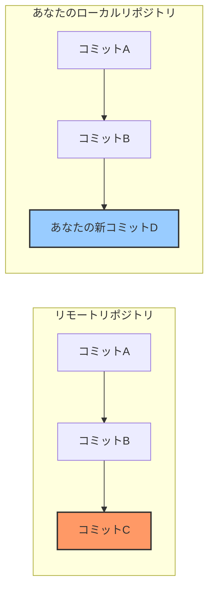
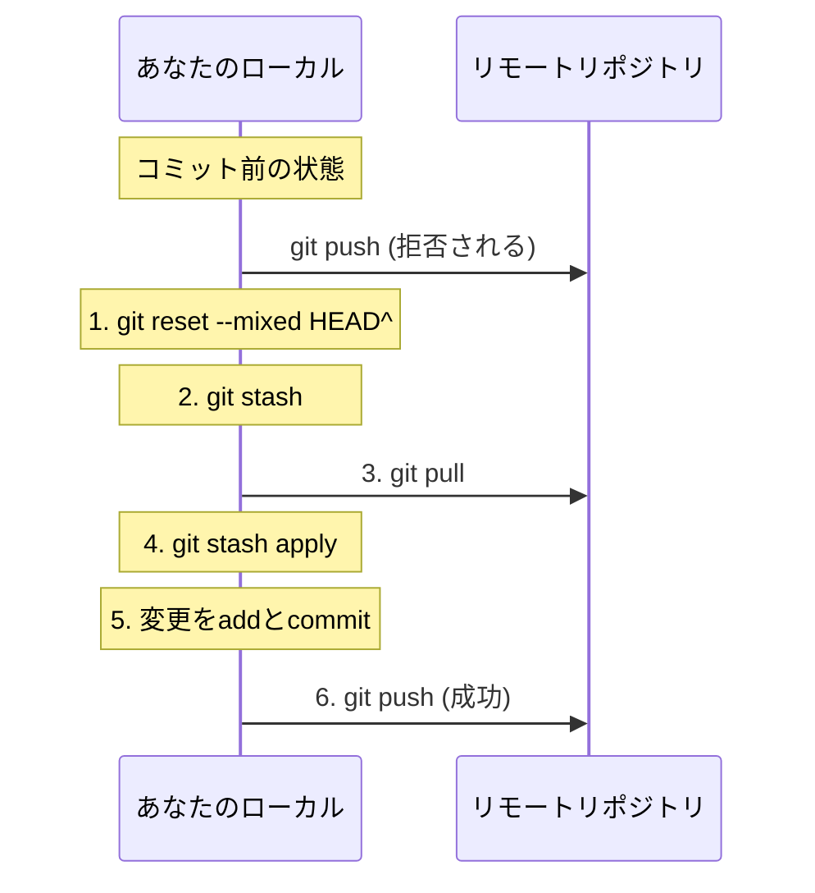
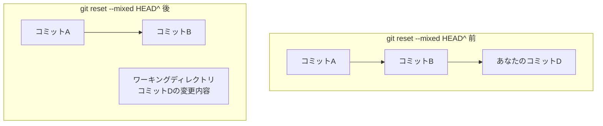
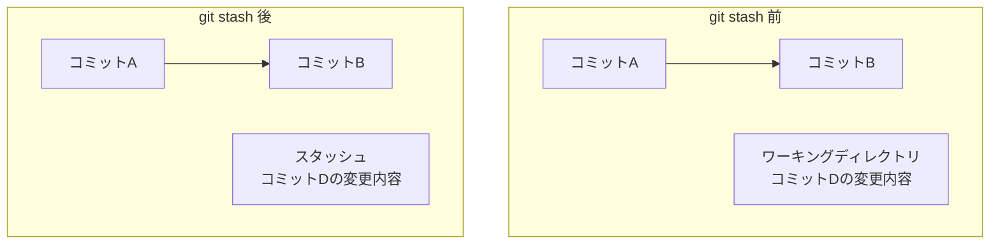
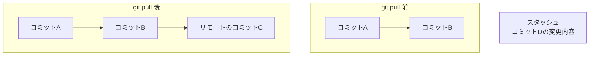
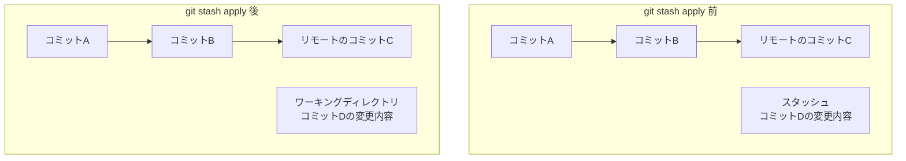
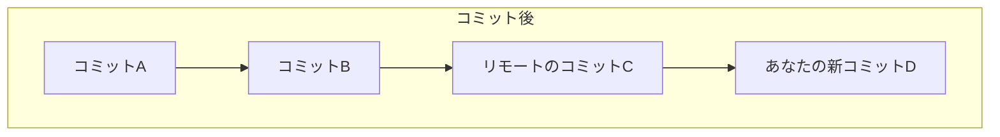
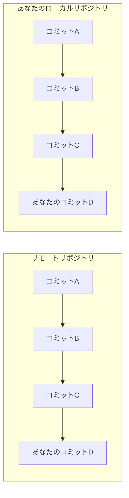

Git を使った開発において最もよくある問題の一つが，リモートリポジトリへのプッシュが拒否されるケースである．特に複数人で開発している場合によく発生する．本記事では，「push拒否」エラーの対処法として，`git reset`，`git stash`，`git pull`を組み合わせた効率的な解決方法を，初心者にもわかりやすく解説する．

## 発生する問題：プッシュが拒否される

以下のようなエラーメッセージを見たことがあるだろうか：

```bash
To github.com:username/repository.git
 ! [rejected]        feature/branch -> feature/branch (fetch first)
error: failed to push some refs to 'github.com:username/repository.git'
hint: Updates were rejected because the remote contains work that you do not
hint: have locally. This is usually caused by another repository pushing to
hint: the same ref. If you want to integrate the remote changes, use
hint: 'git pull' before pushing again.
hint: See the 'Note about fast-forwards' in 'git push --help' for details.
```

このエラーは，リモートリポジトリ（GitHub）に誰かが先にコミットをプッシュしており，あなたの手元（ローカル）にはその変更が反映されていない状態で`git push`を実行した場合に発生する．

## 原因の視覚的な理解



この図が示すように，リモートリポジトリにはコミットCがあるが，あなたのローカルにはそれがなく，代わりにあなた独自のコミットD（青色）がある．Gitはこの状態でのプッシュを拒否する．

## 簡単な解決方法：プル＆プッシュ？

最も単純な解決策は，エラーメッセージの通り`git pull`を実行することだが，これは以下の理由から必ずしも最適ではない：

1. マージコンフリクトが発生する可能性がある
2. 不要な「マージコミット」が生成される
3. コミット履歴が複雑になる

## より効率的な解決方法：reset, stash, pullの組み合わせ

より洗練された解決方法は，以下のステップに従うことである：



### ステップ1：コミットを取り消す（リセット）

最初に，直前のコミットを取り消すが，変更内容は保持する：

```bash
git reset --mixed HEAD^
```

`--mixed`オプションは，コミットを取り消しつつ，変更内容をワーキングディレクトリに残す．`HEAD^`は「1つ前のコミット」を意味する．



### ステップ2：変更を一時保存（スタッシュ）

次に，取り消したコミットの変更内容を一時的に保存する：

```bash
git stash
```

これにより，ワーキングディレクトリの変更が一時的に退避され，「クリーン」な状態になる．



### ステップ3：リモートの変更を取得（プル）

ワーキングディレクトリがクリーンな状態になったので，リモートの変更を安全に取得できる：

```bash
git pull
```

これにより，リモートリポジトリの最新の変更（コミットC）がローカルに取り込まれる．



### ステップ4：変更を復元（スタッシュ適用）

スタッシュした変更を復元する：

```bash
git stash apply
```

これにより，一時保存していた変更内容がワーキングディレクトリに戻る．



この時点で，ワーキングディレクトリには，リモートリポジトリの最新の状態と，あなたの変更内容の両方が含まれている．もしコンフリクトがある場合は，この段階で解決する．

### ステップ5：変更を追加（アド）

変更内容をステージングエリアに追加する：

```bash
git add .
```

### ステップ6：変更をコミット

変更内容を新たにコミットする：

```bash
git commit -m "コミットメッセージ"
```



### ステップ7：プッシュ

最後に，変更をリモートリポジトリにプッシュする：

```bash
git push
```

これで，リモートリポジトリとローカルリポジトリが同期された状態になる．



## 完全なコマンドシーケンス

上記のステップをまとめると，以下のコマンドシーケンスとなる：

```bash
# 1. コミットを取り消す（変更内容は保持）
git reset --mixed HEAD^

# 2. 変更を一時保存
git stash

# 3. リモートの変更を取得
git pull

# 4. 変更を復元
git stash apply

# コンフリクトがある場合はここで解決

# 5. 変更を追加
git add .

# 6. 変更をコミット
git commit -m "コミットメッセージ"

# 7. プッシュ
git push
```

## コンフリクト解決のヒント

`git stash apply`の後にコンフリクトが発生した場合，以下の手順で解決する：

1. コンフリクトのあるファイルを開く
2. コンフリクトマーカー（`<<<<<<<`, `=======`, `>>>>>>>`)を探す
3. 両方の変更を適切に統合する
4. コンフリクトを解決したファイルを保存
5. `git add <ファイル名>`で変更を追加

```bash
# コンフリクト状態の確認
git status

# コンフリクト解決後
git add <ファイル名>
git commit -m "コンフリクトを解決"
git push
```

## 他の解決方法との比較

| 方法 | メリット | デメリット |
|------|----------|------------|
| **git pull** | シンプル，一手順 | マージコミットが生成される<br>履歴が複雑になる |
| **git pull --rebase** | 線形の履歴を維持<br>マージコミットなし | リベース中に複雑なコンフリクトが発生する可能性 |
| **reset + stash + pull** | 変更内容を安全に保持<br>柔軟なコンフリクト解決<br>履歴をクリーンに保つ | 手順が多い |

## まとめ

`git push`が拒否される問題は，複数人での開発では日常的に発生する．本記事で紹介した`git reset`，`git stash`，`git pull`を組み合わせた方法は，やや手順は多いものの，変更内容を安全に保持しながらリモートリポジトリと同期できる効果的な方法である．

この方法に慣れることで，Git操作の理解が深まり，より複雑なバージョン管理のシナリオにも対応できるようになるだろう．
