コンテナ技術の普及に伴い，コンテナの管理・運用方法も多様化している．単一のコンテナを動かす段階から，複数のコンテナを連携させる段階へと発展する中で，様々なオーケストレーションツールが登場した．本記事では，Docker Compose，Docker Swarm，そしてKubernetesという3つの主要なコンテナ管理ツールについて，その特徴や使い方，そして適した使用シーンを初心者向けに解説する．

### 仮想化技術とは

仮想化技術は，物理的なコンピュータハードウェア上に仮想的なコンピュータ環境を作り出す技術である．単一の物理マシン上で複数の仮想マシンを稼働させることで，ハードウェアリソースを効率的に活用できる．仮想化技術は大きく分けて以下の2種類がある：

1. **ハイパーバイザー型仮想化（従来の仮想化）**：
   - 物理ホスト上にハイパーバイザーと呼ばれる仮想化ソフトウェアを導入し，その上で複数の仮想マシン（VM）を稼働させる
   - 各VMは独自のOSカーネルとハードウェアエミュレーションを持つ
   - 代表例：VMware, VirtualBox, Hyper-V, KVM

2. **コンテナ型仮想化**：
   - ホストOSのカーネルを共有しながら，プロセスやファイルシステムを分離する軽量な仮想化技術
   - OSレベルでの分離を実現し，オーバーヘッドが少ない
   - 代表例：Docker, LXC, containerd

#### 仮想化技術の比較図

両者の違いを視覚的に表現すると以下のようになる：

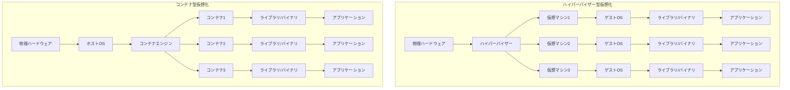
```mermaid
graph TD
    subgraph "ハイパーバイザー型仮想化"
    HW[物理ハードウェア] --> HP[ハイパーバイザー]
    HP --> VM1[仮想マシン1]
    HP --> VM2[仮想マシン2]
    HP --> VM3[仮想マシン3]
    VM1 --> GK1[ゲストOS]
    VM2 --> GK2[ゲストOS]
    VM3 --> GK3[ゲストOS]
    GK1 --> LB1[ライブラリ/バイナリ]
    GK2 --> LB2[ライブラリ/バイナリ]
    GK3 --> LB3[ライブラリ/バイナリ]
    LB1 --> AP1[アプリケーション]
    LB2 --> AP2[アプリケーション]
    LB3 --> AP3[アプリケーション]
    end

    subgraph "コンテナ型仮想化"
    HW2[物理ハードウェア] --> OS[ホストOS]
    OS --> CE[コンテナエンジン]
    CE --> C1[コンテナ1]
    CE --> C2[コンテナ2]
    CE --> C3[コンテナ3]
    C1 --> CLB1[ライブラリ/バイナリ]
    C2 --> CLB2[ライブラリ/バイナリ]
    C3 --> CLB3[ライブラリ/バイナリ]
    CLB1 --> CAP1[アプリケーション]
    CLB2 --> CAP2[アプリケーション]
    CLB3 --> CAP3[アプリケーション]
    end
```

ハイパーバイザー型仮想化では各仮想マシンが独自のOSを持ちますが，コンテナ型仮想化ではホストOSのカーネルを共有し，アプリケーションとその依存関係のみを分離します．そのため，コンテナはより軽量で起動が高速なのが特徴です．

### コンテナ仮想化の仕組み

コンテナ仮想化は，Linuxカーネルの以下の機能を活用して実現されている：

1. **名前空間（Namespace）**：
   - プロセスが見えるリソース（プロセスID, ネットワークインターフェース, マウントポイントなど）を分離
   - コンテナごとに独立した空間を提供し，互いに干渉しないようにする

2. **コントロールグループ（cgroups）**：
   - コンテナが使用できるリソース（CPU, メモリ, ディスクI/Oなど）を制限・管理
   - リソースの公平な分配と制限を実現

3. **UnionFSファイルシステム**：
   - 複数のファイルシステムを重ね合わせて，単一の統合されたファイルシステムとして見せる
   - イメージを階層構造で管理し，効率的なストレージ利用を実現

従来の仮想マシンと比較すると，コンテナは以下の利点がある：

- **軽量**：OSカーネルを共有するため，起動が高速でリソース使用量が少ない
- **可搬性**：依存関係を含めてパッケージ化されているため，環境間での移行が容易
- **効率性**：同じホスト上により多くのアプリケーションを稼働させられる
- **一貫性**：開発環境と本番環境で同一の実行環境を保証

### Dockerとは

Dockerは，コンテナ技術を簡単に利用するためのプラットフォームである．2013年に登場して以来，コンテナ技術の事実上の標準となった．Dockerの主な特徴は以下の通り：

1. **簡単な操作性**：
   - 直感的なCLIと豊富なドキュメントにより，コンテナ操作が容易
   - 「ビルド，シップ，実行」の一貫したワークフロー

2. **移植性**：
   - 「一度ビルドすれば，どこでも実行可能」という理念
   - 開発環境と本番環境の一貫性確保

3. **効率性**：
   - イメージの階層構造による効率的なストレージ利用
   - 差分更新によるイメージビルドの高速化

4. **エコシステム**：
   - Docker Hub等での公式イメージの提供
   - 豊富なツールやサービスとの連携

### Docker Container（コンテナ）

Docker Containerは，Dockerイメージから作成される実行可能なインスタンスである．コンテナの主な特徴と概念は以下の通り：

1. **イメージの実行インスタンス**：
   - コンテナはイメージから作成される状態を持つ動的なインスタンス
   - 同じイメージから複数の独立したコンテナを起動可能

2. **分離された実行環境**：
   - 独自のファイルシステム，ネットワーク，プロセス空間を持つ
   - ホストシステムから分離されているが，ホストのカーネルを共有

3. **ライフサイクル管理**：
   - 作成（create），起動（start），停止（stop），再起動（restart），削除（rm）
   - 状態の保存と復元が可能

4. **リソース制限**：
   - CPUやメモリ使用量を制限可能
   - QoS（Quality of Service）の確保

基本的なコンテナ操作コマンド：

```bash
# コンテナの作成と起動
docker run -d --name my-container nginx

# 実行中のコンテナ一覧
docker ps

# すべてのコンテナ一覧（停止したものも含む）
docker ps -a

# コンテナの停止
docker stop my-container

# コンテナの起動
docker start my-container

# コンテナ内でコマンド実行
docker exec -it my-container bash

# コンテナの削除（停止状態のみ）
docker rm my-container

# 強制削除（実行中でも）
docker rm -f my-container
```

### Docker Image（イメージ）

Docker Imageは，コンテナの実行に必要なファイルシステム，アプリケーションコード，依存関係，環境変数などを含む不変のテンプレートである．イメージの主な特徴と概念は以下の通り：

1. **レイヤー構造**：
   - イメージは複数の読み取り専用レイヤーで構成される
   - 各レイヤーは前のレイヤーとの差分のみを保存
   - 複数のイメージ間でレイヤーを共有し，ストレージを効率化

2. **Dockerfile**：
   - イメージをコードとして定義するテキストファイル
   - ベースイメージの指定，コマンド実行，ファイルのコピーなどを記述
   - インフラのコード化（Infrastructure as Code）を実現

3. **イミュータブル（不変）**：
   - 一度ビルドされたイメージは変更不可
   - 変更が必要な場合は新しいイメージをビルド
   - 一貫性と再現性を確保

4. **タグとバージョニング**：
   - イメージにはタグを付けて管理（例：nginx:1.19）
   - 同じイメージの異なるバージョンを管理可能

Dockerfileの例：

```Dockerfile
# ベースイメージの指定
FROM node:14-alpine

# 作業ディレクトリの設定
WORKDIR /app

# パッケージ依存関係のコピーとインストール
COPY package*.json ./
RUN npm install

# アプリケーションコードのコピー
COPY . .

# ポート公開
EXPOSE 3000

# コンテナ起動時のコマンド
CMD ["npm", "start"]
```

基本的なイメージ操作コマンド：

```bash
# イメージのビルド
docker build -t myapp:1.0 .

# イメージ一覧表示
docker images

# イメージのプル（Docker Hubからダウンロード）
docker pull nginx:latest

# イメージのプッシュ（Docker Hubなどにアップロード）
docker push username/myapp:1.0

# イメージの削除
docker rmi myapp:1.0
```

### Docker Volume（ボリューム）

Docker Volumeは，コンテナ内のデータを永続化するための仕組みである．コンテナは本来ステートレス（状態を持たない）であり，コンテナ自体が削除されるとデータも失われる．ボリュームはこの問題を解決するための機能である．ボリュームの主な特徴と種類は以下の通り：

1. **永続化の仕組み**：
   - コンテナが削除されてもデータを保持
   - ホストマシン上の特定の場所にマウントされる
   - 複数のコンテナ間でデータ共有が可能

2. **ボリュームの種類**：
   - **名前付きボリューム**：Dockerが管理する特別な場所に作成される永続ボリューム
   - **バインドマウント**：ホストマシン上の特定のディレクトリをコンテナにマウント
   - **tmpfs マウント**：一時的なファイルシステムをメモリに作成（永続化されない）

3. **データ管理の利点**：
   - データとアプリケーションの分離
   - コンテナの置き換えやアップグレードが容易
   - バックアップや復元が簡単

基本的なボリューム操作コマンド：

```bash
# 名前付きボリュームの作成
docker volume create my-volume

# ボリューム一覧表示
docker volume ls

# ボリュームを使用してコンテナ起動
docker run -d --name db -v my-volume:/var/lib/mysql mysql:5.7

# バインドマウントを使用してコンテナ起動
docker run -d --name web -v $(pwd)/html:/usr/share/nginx/html nginx

# ボリュームの詳細表示
docker volume inspect my-volume

# 不要なボリュームの削除
docker volume rm my-volume

# 未使用ボリュームの一括削除
docker volume prune
```

ボリュームを使用したデータベースの永続化の例：

```yaml
version: '3'
services:
  db:
    image: postgres:13
    volumes:
      - postgres-data:/var/lib/postgresql/data
    environment:
      POSTGRES_PASSWORD: example

volumes:
  postgres-data:
    # このボリュームはDockerによって自動的に作成・管理される
```

以上のコンテナ基礎技術の理解は，Docker Compose，Docker Swarm，Kubernetesといったオーケストレーションツールを扱う上での重要な基盤となる．


## Docker Composeとは

### 本質と概要

Docker Composeは，複数のDockerコンテナを定義し実行するためのツールである．YAMLファイル（通常は`docker-compose.yml`）に複数のコンテナの設定を記述し，単一のコマンドですべてのコンテナを起動・停止できる．

Docker Composeの本質は「**開発環境でのマルチコンテナアプリケーション管理の簡易化**」にある．マイクロサービスアーキテクチャにおける複数のサービス（例：Webサーバ，データベース，キャッシュサーバなど）を，単一のコマンドで制御できる点が強みである．

### インストール方法

Docker Desktop（Windows/Mac）には標準でDocker Composeが含まれている．Linuxの場合は以下のコマンドでインストールできる：

```bash
sudo apt-get update
sudo apt-get install docker-compose-plugin
```

### 基本的な使い方

1. `docker-compose.yml`ファイルを作成する：

```yaml
version: '3'
services:
  web:
    image: nginx:latest
    ports:
      - "8080:80"
  db:
    image: mysql:5.7
    environment:
      MYSQL_ROOT_PASSWORD: example
```

2. コンテナを起動する：

```bash
docker compose up
```

3. バックグラウンドで起動する場合：

```bash
docker compose up -d
```

4. コンテナを停止する：

```bash
docker compose down
```

### 主要コマンド

| コマンド | 説明 |
|---------|------|
| `docker compose up` | 定義されたすべてのサービスを起動 |
| `docker compose down` | すべてのサービスを停止・削除 |
| `docker compose ps` | 実行中のコンテナを表示 |
| `docker compose logs` | コンテナのログを表示 |
| `docker compose exec <サービス名> <コマンド>` | 実行中コンテナでコマンドを実行 |

### Docker Composeの利点と限界

**利点：**
- 開発環境のセットアップが容易
- 複数コンテナの管理を1つのファイルで定義
- インフラのコード化（Infrastructure as Code）
- サービス間の依存関係を管理

**限界：**
- 単一ホスト（1台のマシン）でのみ動作
- 本番環境には不向き（スケーリングやフェイルオーバーの機能が限定的）
- コンテナの動的なスケーリングやロードバランシングが複雑

## Docker Swarmとは

Docker Swarmは，Docker社が開発した複数のDockerホストをクラスター化するためのネイティブなオーケストレーションツールである．Swarmの本質は「**Docker Composeの本番環境への拡張**」と言える．

Docker Swarmは複数のホスト（物理サーバーやVM）にまたがってコンテナを分散配置し，高可用性を実現する．マネージャーノードとワーカーノードという役割分担により，クラスター全体を管理する．

#### Docker Swarmのアーキテクチャ

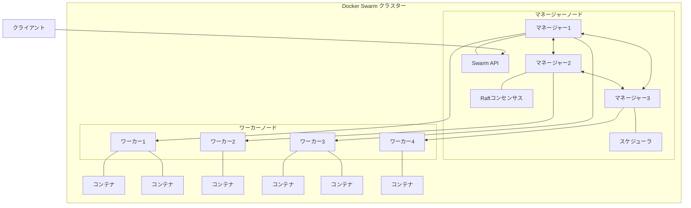
```mermaid
graph TD
    subgraph "Docker Swarm クラスター"
        subgraph "マネージャーノード"
            M1[マネージャー1] <--> M2[マネージャー2]
            M2 <--> M3[マネージャー3]
            M3 <--> M1
            M1 --- SwarmAPI[Swarm API]
            M2 --- Raft[Raftコンセンサス]
            M3 --- Scheduler[スケジューラ]
        end

        subgraph "ワーカーノード"
            W1[ワーカー1]
            W2[ワーカー2]
            W3[ワーカー3]
            W4[ワーカー4]
        end

        M1 --> W1
        M2 --> W2
        M1 --> W3
        M3 --> W4

        W1 --- C1[コンテナ]
        W1 --- C2[コンテナ]
        W2 --- C3[コンテナ]
        W3 --- C4[コンテナ]
        W3 --- C5[コンテナ]
        W4 --- C6[コンテナ]
    end

    Client[クライアント] --> SwarmAPI
```

### Docker Swarmのノードタイプ

Docker Swarmクラスターは、以下の3種類のノードタイプで構成されます：

#### 1. クライアント（Client）

クライアントは、Docker Swarmクラスターを操作するためのインターフェースを提供するノードです。主な特徴は以下の通りです：

- Docker CLIコマンドを実行するための環境
- クラスターの管理や操作を行うためのツールを提供
- マネージャーノードやワーカーノードと直接通信
- 開発者のローカルマシンやCI/CDサーバーなどで動作

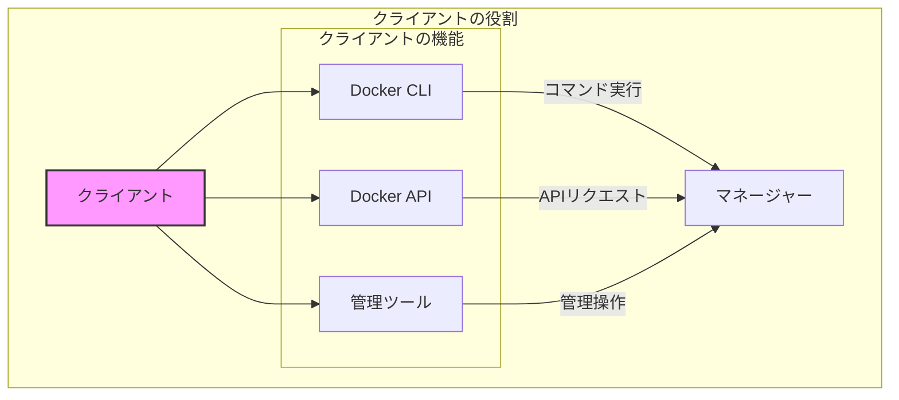
```mermaid
graph TD
    subgraph "クライアントの役割"
        C[クライアント]
        style C fill:#f9f,stroke:#333,stroke-width:2px

        subgraph "クライアントの機能"
            CLI[Docker CLI]
            API[Docker API]
            Tools[管理ツール]
        end

        C --> CLI
        C --> API
        C --> Tools

        CLI --> |コマンド実行| M[マネージャー]
        API --> |APIリクエスト| M
        Tools --> |管理操作| M
    end
```

#### 2. マネージャーノード（Manager Node）

マネージャーノードは、クラスターの制御と管理を担当する重要なノードです。主な特徴は以下の通りです：

- クラスターの状態管理と制御
- サービスのスケジューリングと配置の決定
- Raftコンセンサスアルゴリズムによる分散合意
- クラスターの設定とメタデータの管理
- ワーカーノードの監視と管理

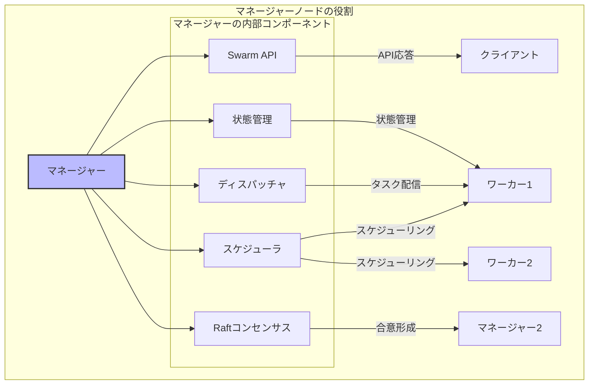
```mermaid
graph TD
    subgraph "マネージャーノードの役割"
        M[マネージャー]
        style M fill:#bbf,stroke:#333,stroke-width:2px

        subgraph "マネージャーの内部コンポーネント"
            API[Swarm API]
            Scheduler[スケジューラ]
            Raft[Raftコンセンサス]
            Dispatcher[ディスパッチャ]
            State[状態管理]
        end

        M --> API
        M --> Scheduler
        M --> Raft
        M --> Dispatcher
        M --> State

        API --> |API応答| C[クライアント]
        Scheduler --> |スケジューリング| W1[ワーカー1]
        Scheduler --> |スケジューリング| W2[ワーカー2]
        Raft --> |合意形成| M2[マネージャー2]
        Dispatcher --> |タスク配信| W1
        State --> |状態管理| W1
    end
```

#### 3. ワーカーノード（Worker Node）

ワーカーノードは、実際のコンテナを実行するノードです。主な特徴は以下の通りです：

- コンテナの実行と管理
- マネージャーからの指示に従って動作
- リソース（CPU、メモリ、ストレージ）の提供
- コンテナの状態監視と報告
- サービスのスケーリングに対応

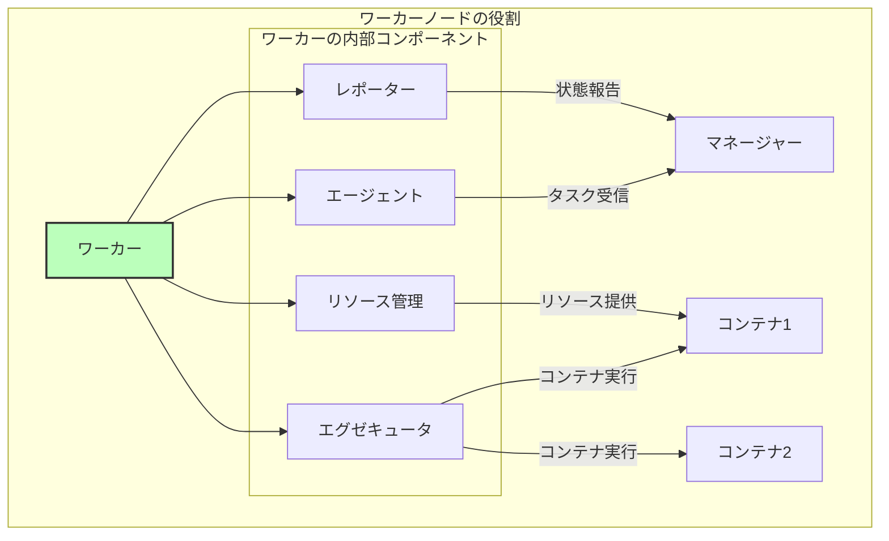
```mermaid
graph TD
    subgraph "ワーカーノードの役割"
        W[ワーカー]
        style W fill:#bfb,stroke:#333,stroke-width:2px

        subgraph "ワーカーの内部コンポーネント"
            Agent[エージェント]
            Executor[エグゼキュータ]
            Reporter[レポーター]
            Resources[リソース管理]
        end

        W --> Agent
        W --> Executor
        W --> Reporter
        W --> Resources

        Agent --> |タスク受信| M[マネージャー]
        Executor --> |コンテナ実行| C1[コンテナ1]
        Executor --> |コンテナ実行| C2[コンテナ2]
        Reporter --> |状態報告| M
        Resources --> |リソース提供| C1
    end
```

#### ノード間の通信と役割分担

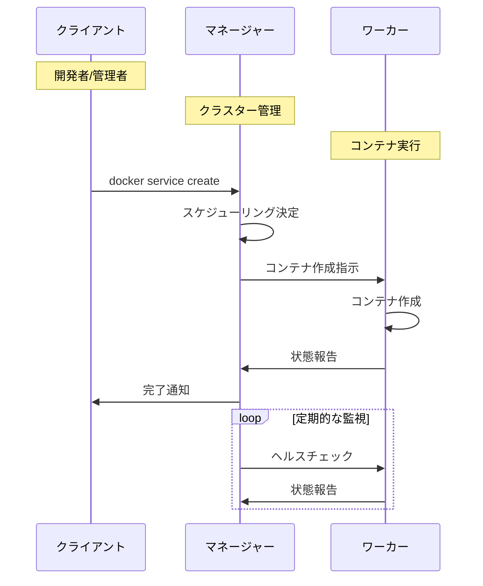
```mermaid
sequenceDiagram
    participant C as クライアント
    participant M as マネージャー
    participant W as ワーカー

    Note over C: 開発者/管理者
    Note over M: クラスター管理
    Note over W: コンテナ実行

    C->>M: docker service create
    M->>M: スケジューリング決定
    M->>W: コンテナ作成指示
    W->>W: コンテナ作成
    W->>M: 状態報告
    M->>C: 完了通知

    loop 定期的な監視
        M->>W: ヘルスチェック
        W->>M: 状態報告
    end
```

#### ノードタイプの比較表

| 特徴 | クライアント | マネージャー | ワーカー |
|------|------------|------------|---------|
| **主な役割** | クラスター操作 | クラスター管理 | コンテナ実行 |
| **必須性** | 任意 | 必須（1台以上） | 必須（1台以上） |
| **リソース要件** | 低 | 中〜高 | 中 |
| **可用性要件** | 低 | 高 | 中 |
| **実行可能な操作** | 全操作 | 全操作 | 制限あり |
| **データ保持** | なし | クラスター状態 | コンテナ状態 |
| **スケーリング** | 任意 | 奇数台推奨 | 必要に応じて |

これらのノードタイプの適切な組み合わせと配置により、Docker Swarmクラスターは効率的に動作し、高可用性とスケーラビリティを実現します。特に、マネージャーノードの冗長化（通常3台以上）は、クラスターの安定性を確保する上で重要です。

#### サービスのスケーリングとローリングアップデート

Docker Swarmでは、サービスのスケーリングとローリングアップデートという2つの重要な機能が提供されています。これらの機能により、アプリケーションの可用性を維持しながら、リソースの効率的な利用やアプリケーションの更新が可能になります。

#### サービスのスケーリング

サービスのスケーリングとは、実行中のコンテナの数を増減させることで、アプリケーションの処理能力を調整する機能です。主な特徴は以下の通りです：

1. **水平スケーリング**：
   - 同じサービスを実行するコンテナの数を増減
   - 負荷に応じてリソースを柔軟に調整
   - 高可用性の実現

2. **スケーリングの方法**：
   - 手動スケーリング：`docker service scale`コマンドで直接指定
   - 自動スケーリング：外部ツール（例：Prometheus）との連携で実現可能

3. **スケーリングの利点**：
   - トラフィックの増加に対応
   - リソースの効率的な利用
   - 障害時の冗長性確保

4. **スケーリングの制約**：
   - 利用可能なリソースの範囲内でのみ可能
   - ネットワークやストレージの制約を考慮する必要がある

#### ローリングアップデート

ローリングアップデートとは、サービスを実行しているコンテナを段階的に更新することで、ダウンタイム(主にコンテナの運用や管理において，サービスが利用できない状態)を最小限に抑えながらアプリケーションを更新する機能です。主な特徴は以下の通りです：

1. **更新プロセス**：
   - 新しいバージョンのコンテナを段階的に作成
   - 古いバージョンのコンテナを段階的に削除
   - サービス全体の可用性を維持

2. **更新の制御**：
   - 更新の速度（一度に更新するコンテナ数）
   - 更新間の待機時間
   - ヘルスチェックの設定

3. **ローリングアップデートの利点**：
   - ダウンタイムの最小化
   - 更新中のサービス継続性
   - 問題発生時のロールバックが容易

4. **更新戦略**：
   - 一括更新：すべてのコンテナを同時に更新
   - 段階的更新：一度に一部のコンテナのみを更新
   - カナリアリリース：一部のトラフィックを新しいバージョンに振り分け

#### スケーリングとローリングアップデートの視覚的表現

##### サービスのスケーリング

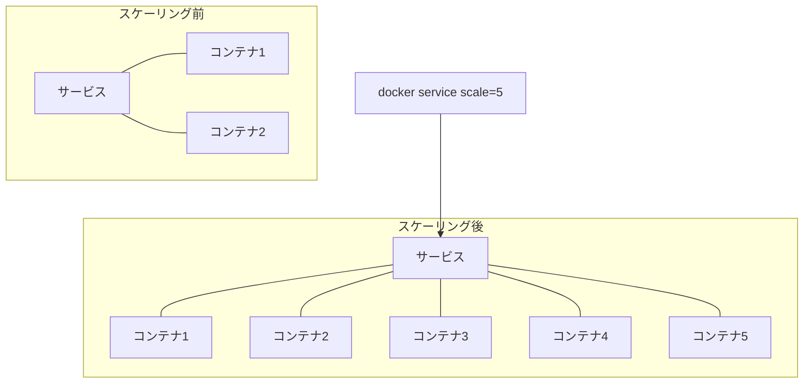
```mermaid
graph TD
    subgraph "スケーリング前"
        SB1[サービス] --- CB1[コンテナ1]
        SB1 --- CB2[コンテナ2]
    end

    subgraph "スケーリング後"
        SA1[サービス] --- CA1[コンテナ1]
        SA1 --- CA2[コンテナ2]
        SA1 --- CA3[コンテナ3]
        SA1 --- CA4[コンテナ4]
        SA1 --- CA5[コンテナ5]
    end

    Scale[docker service scale=5] --> SA1
```

##### ローリングアップデート

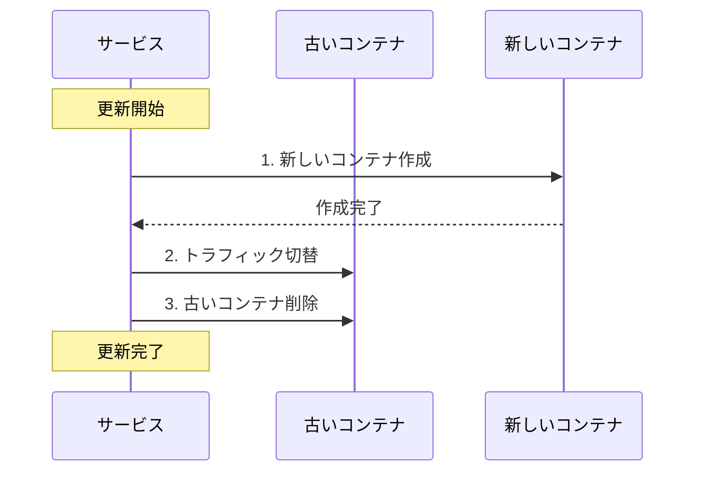
```mermaid
sequenceDiagram
    participant S as サービス
    participant O as 古いコンテナ
    participant N as 新しいコンテナ

    Note over S: 更新開始
    S->>N: 1. 新しいコンテナ作成
    N-->>S: 作成完了
    S->>O: 2. トラフィック切替
    S->>O: 3. 古いコンテナ削除
    Note over S: 更新完了
```

これらの機能を適切に活用することで、アプリケーションの可用性を維持しながら、効率的なリソース管理と安全な更新が可能になります。特に、本番環境での運用において、これらの機能は重要な役割を果たします。

### Swarmモードの有効化

Docker Swarmを使用するには，まずSwarmモードを有効化する必要がある：

```bash
# マネージャーノードの初期化
docker swarm init --advertise-addr <マネージャーノードのIPアドレス>

# 出力されたコマンドを使って他のノードをワーカーとして追加
# 例：
# docker swarm join --token SWMTKN-1-xxxx <マネージャーノードのIP>:2377
```

#### Swarm初期化とノード参加の流れ

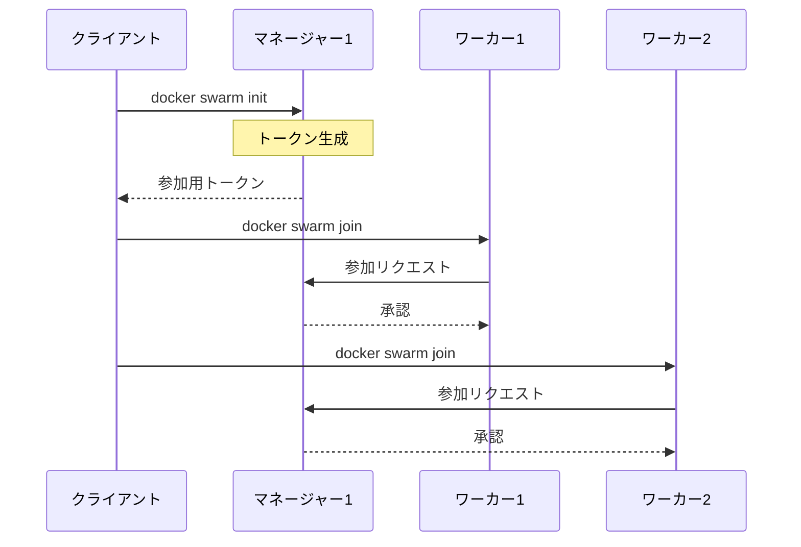
```mermaid
sequenceDiagram
    participant C as クライアント
    participant M1 as マネージャー1
    participant W1 as ワーカー1
    participant W2 as ワーカー2

    C->>M1: docker swarm init
    Note over M1: トークン生成
    M1-->>C: 参加用トークン
    C->>W1: docker swarm join
    W1->>M1: 参加リクエスト
    M1-->>W1: 承認
    C->>W2: docker swarm join
    W2->>M1: 参加リクエスト
    M1-->>W2: 承認
```

### サービスの作成と管理

Docker Swarmではコンテナをサービスとして定義・管理する：

```bash
# NGINXサービスを作成（3つのレプリカ）
docker service create --name webserver --replicas 3 -p 80:80 nginx

# サービスの状態確認
docker service ls
docker service ps webserver

# サービスのスケール
docker service scale webserver=5

# サービスの削除
docker service rm webserver
```

#### サービス作成とスケーリングの流れ

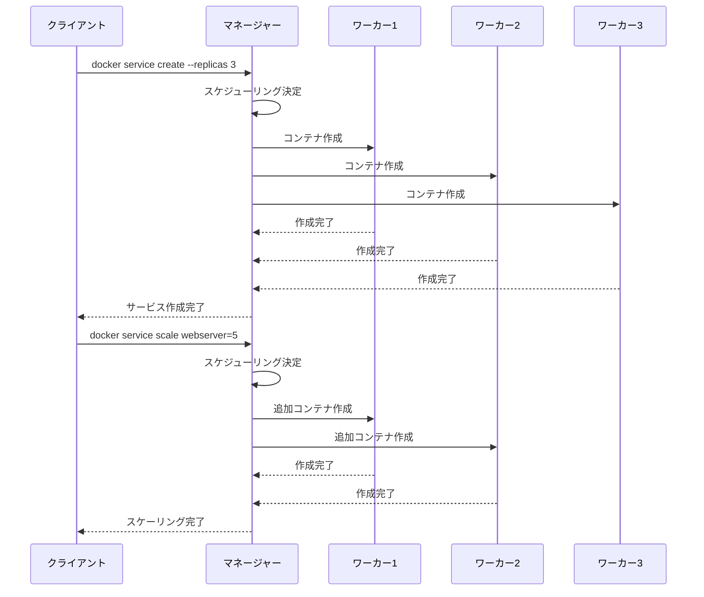
```mermaid
sequenceDiagram
    participant C as クライアント
    participant M as マネージャー
    participant W1 as ワーカー1
    participant W2 as ワーカー2
    participant W3 as ワーカー3

    C->>M: docker service create --replicas 3
    M->>M: スケジューリング決定
    M->>W1: コンテナ作成
    M->>W2: コンテナ作成
    M->>W3: コンテナ作成
    W1-->>M: 作成完了
    W2-->>M: 作成完了
    W3-->>M: 作成完了
    M-->>C: サービス作成完了

    C->>M: docker service scale webserver=5
    M->>M: スケジューリング決定
    M->>W1: 追加コンテナ作成
    M->>W2: 追加コンテナ作成
    W1-->>M: 作成完了
    W2-->>M: 作成完了
    M-->>C: スケーリング完了
```

### Swarmでのスタック管理

Docker Swarmでは、複数のサービスをグループ化して管理するための「スタック」という概念があります。スタックは、関連するサービスをまとめてデプロイ・管理するための便利な方法を提供します。

#### スタックの概念

1. **スタックとは**：
   - 複数のサービスを論理的にグループ化した単位
   - Docker Composeファイルを使用して定義
   - 関連するサービスを一括で管理可能

2. **スタックの利点**：
   - 複数サービスの一括デプロイ
   - サービス間の依存関係の管理
   - 環境ごとの設定の分離
   - デプロイメントの再現性確保

3. **スタックの構成要素**：
   - サービス定義
   - ネットワーク設定
   - ボリューム設定
   - シークレットと設定

#### スタックデプロイの方法とデプロイ先

スタックデプロイは、Docker Swarmクラスター内の特定のノードにサービスを配置するプロセスです。デプロイ方法とデプロイ先の選択は、アプリケーションの要件とクラスターの構成に基づいて決定されます。

##### デプロイ方法

1. **基本的なデプロイ方法**：
   ```bash
   # スタックのデプロイ
   docker stack deploy -c docker-compose.yml myapp

   # 特定のスタックのサービス一覧を表示
   docker stack services myapp

   # スタックの削除
   docker stack rm myapp
   ```

2. **デプロイメントの制御オプション**：
   ```bash
   # プルーニング（未使用のリソースを削除）
   docker stack deploy --prune -c docker-compose.yml myapp

   # デプロイメントの確認
   docker stack ps myapp
   ```

##### デプロイ先の選択

1. **ノードの選択方法**：
   ```yaml
   version: '3.8'
   services:
     web:
       image: nginx
       deploy:
         placement:
           constraints:
             - node.role == worker  # ワーカーノードのみに配置
             - node.labels.zone == east  # 特定のラベルを持つノードに配置
   ```

2. **リソース制限の設定**：
   ```yaml
   services:
     web:
       image: nginx
       deploy:
         resources:
           limits:
             cpus: '0.50'
             memory: 512M
           reservations:
             cpus: '0.25'
             memory: 256M
   ```

3. **レプリカの配置戦略**：
   ```yaml
   services:
     web:
       image: nginx
       deploy:
         replicas: 3
         placement:
           preferences:
             - spread: node.labels.zone  # 異なるゾーンに分散配置
   ```

##### デプロイメントの視覚的表現

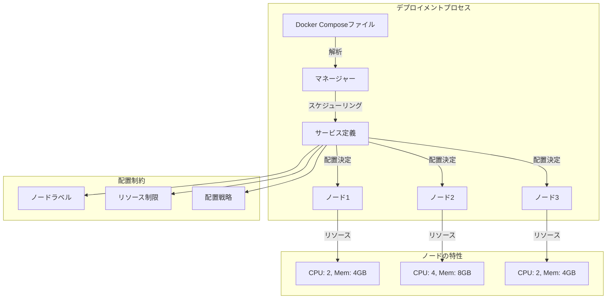
```mermaid
graph TD
    subgraph "デプロイメントプロセス"
        DC[Docker Composeファイル] --> |解析| M[マネージャー]
        M --> |スケジューリング| S[サービス定義]
        S --> |配置決定| N1[ノード1]
        S --> |配置決定| N2[ノード2]
        S --> |配置決定| N3[ノード3]
    end

    subgraph "ノードの特性"
        N1 --> |リソース| R1[CPU: 2, Mem: 4GB]
        N2 --> |リソース| R2[CPU: 4, Mem: 8GB]
        N3 --> |リソース| R3[CPU: 2, Mem: 4GB]
    end

    subgraph "配置制約"
        C1[ノードラベル]
        C2[リソース制限]
        C3[配置戦略]
    end

    S --> C1
    S --> C2
    S --> C3
```

##### デプロイメントの考慮事項

1. **ノードの特性**：
   - CPUコア数とメモリ容量
   - ストレージの種類と容量
   - ネットワーク帯域幅
   - 地理的な位置（データセンター/リージョン）

2. **配置制約**：
   - ノードの役割（マネージャー/ワーカー）
   - ノードのラベルとメタデータ
   - リソースの可用性
   - ネットワークの近接性

3. **スケーリング戦略**：
   - 水平スケーリング（レプリカ数の増減）
   - 垂直スケーリング（リソース制限の調整）
   - 自動スケーリングの設定

4. **高可用性の確保**：
   - 複数ノードへの分散配置
   - 障害ドメインの考慮
   - ヘルスチェックの設定
   - ロールバック戦略

これらの要素を考慮しながら、アプリケーションの要件に最適なデプロイメント戦略を選択することが重要です。特に、本番環境での運用においては、可用性、パフォーマンス、セキュリティのバランスを取ることが求められます。

### ネットワーク管理

```bash
# オーバーレイネットワークの作成
docker network create --driver overlay my-network

# ネットワーク一覧表示
docker network ls

# サービスをネットワークに接続
docker service update --network-add my-network webserver
```

#### オーバーレイネットワークの動作

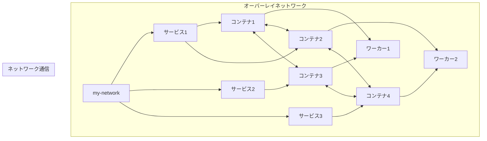
```mermaid
graph TD
    subgraph "オーバーレイネットワーク"
        N[my-network]
        S1[サービス1]
        S2[サービス2]
        S3[サービス3]

        N --> S1
        N --> S2
        N --> S3

        S1 --> C1[コンテナ1]
        S1 --> C2[コンテナ2]
        S2 --> C3[コンテナ3]
        S3 --> C4[コンテナ4]

        C1 --> W1[ワーカー1]
        C2 --> W2[ワーカー2]
        C3 --> W1
        C4 --> W2
    end

    subgraph "ネットワーク通信"
        C1 <--> C2
        C1 <--> C3
        C2 <--> C4
        C3 <--> C4
    end
```

これらの図により、Docker Swarmの主要なコマンドが実行された際のクラスター内での動作や状態変化が視覚的に理解できるようになります。各コマンドがどのようにクラスターの状態を変更し、どのような効果をもたらすのかが明確になります。

### ローカル環境でのGoアプリケーションデプロイとスケーリング効果の検証

ローカル環境でGoアプリケーションをDocker Swarmにデプロイし，そのスケーリング効果を検証する完全な例を紹介する．この例では，Goで書かれたマイクロサービスをデプロイし，Apache Benchを使って負荷テストを行う．

#### 1. テスト用Goアプリケーションの作成

まず、APIエンドポイントを提供するシンプルなGoマイクロサービスを作成します：

```go
package main

import (
    "context"
    "encoding/json"
    "fmt"
    "log"
    "net/http"
    "os"
    "time"

    "github.com/go-redis/redis/v8"
    "github.com/gorilla/mux"
)

type Message struct {
    ID      string    `json:"id"`
    Content string    `json:"content"`
    Time    time.Time `json:"time"`
}

var ctx = context.Background()
var redisClient *redis.Client

func main() {
    // Redis接続設定
    redisHost := os.Getenv("REDIS_HOST")
    if redisHost == "" {
        redisHost = "redis:6379"
    }

    redisClient = redis.NewClient(&redis.Options{
        Addr: redisHost,
    })

    // 接続確認
    _, err := redisClient.Ping(ctx).Result()
    if err != nil {
        log.Printf("Redis接続エラー: %v", err)
    } else {
        log.Printf("Redisに接続しました: %s", redisHost)
    }

    r := mux.NewRouter()
    r.HandleFunc("/", homeHandler).Methods("GET")
    r.HandleFunc("/messages", getMessagesHandler).Methods("GET")
    r.HandleFunc("/messages", postMessageHandler).Methods("POST")
    r.HandleFunc("/health", healthCheckHandler).Methods("GET")

    port := os.Getenv("PORT")
    if port == "" {
        port = "8080"
    }

    log.Printf("サーバーを起動します: :%s", port)
    log.Fatal(http.ListenAndServe(":"+port, r))
}

func homeHandler(w http.ResponseWriter, r *http.Request) {
    w.WriteHeader(http.StatusOK)
    fmt.Fprintf(w, "Go Microservice API - 動作中")
}

func getMessagesHandler(w http.ResponseWriter, r *http.Request) {
    messages, err := redisClient.LRange(ctx, "messages", 0, -1).Result()
    if err != nil {
        http.Error(w, err.Error(), http.StatusInternalServerError)
        return
    }

    var messageList []Message
    for _, msg := range messages {
        var message Message
        if err := json.Unmarshal([]byte(msg), &message); err != nil {
            continue
        }
        messageList = append(messageList, message)
    }

    w.Header().Set("Content-Type", "application/json")
    json.NewEncoder(w).Encode(messageList)
}

func postMessageHandler(w http.ResponseWriter, r *http.Request) {
    var message Message
    if err := json.NewDecoder(r.Body).Decode(&message); err != nil {
        http.Error(w, err.Error(), http.StatusBadRequest)
        return
    }

    message.ID = fmt.Sprintf("%d", time.Now().UnixNano())
    message.Time = time.Now()

    msgJSON, err := json.Marshal(message)
    if err != nil {
        http.Error(w, err.Error(), http.StatusInternalServerError)
        return
    }

    if err := redisClient.LPush(ctx, "messages", msgJSON).Err(); err != nil {
        http.Error(w, err.Error(), http.StatusInternalServerError)
        return
    }

    w.Header().Set("Content-Type", "application/json")
    w.WriteHeader(http.StatusCreated)
    json.NewEncoder(w).Encode(message)
}

func healthCheckHandler(w http.ResponseWriter, r *http.Request) {
    // Redisの接続確認
    _, err := redisClient.Ping(ctx).Result()
    if err != nil {
        w.WriteHeader(http.StatusServiceUnavailable)
        fmt.Fprintf(w, "Redis接続エラー")
        return
    }

    w.WriteHeader(http.StatusOK)
    fmt.Fprintf(w, "Healthy")
}
```

#### 2. 必要なファイルの準備

**go.mod:**
```go
module gomicroservice

go 1.19

require (
    github.com/go-redis/redis/v8 v8.11.5
    github.com/gorilla/mux v1.8.0
)
```

**Dockerfile:**
```Dockerfile
FROM golang:1.19-alpine AS builder

WORKDIR /app
COPY go.mod go.sum ./
RUN go mod download
COPY . .
RUN CGO_ENABLED=0 GOOS=linux go build -o goapp .

FROM alpine:latest
RUN apk --no-cache add ca-certificates
WORKDIR /app
COPY --from=builder /app/goapp .
EXPOSE 8080
CMD ["./goapp"]
```

**docker-compose.yml:**
```yaml
version: '3.8'

services:
  api:
    build: .
    image: go-microservice:latest
    ports:
      - "8080:8080"
    environment:
      - REDIS_HOST=redis:6379
    deploy:
      replicas: 1  # 初期は1レプリカ
      resources:
        limits:
          cpus: '0.25'
          memory: 256M
      restart_policy:
        condition: on-failure
    depends_on:
      - redis

  redis:
    image: redis:alpine
    ports:
      - "6379:6379"
    volumes:
      - redis_data:/data
    deploy:
      placement:
        constraints:
          - node.role == manager
      resources:
        limits:
          cpus: '0.25'
          memory: 256M

volumes:
  redis_data:
```

#### 3. Docker Swarmの初期化とデプロイ

```bash
# Swarmモードの初期化（初回のみ）
docker swarm init

# スタックのデプロイ
docker stack deploy -c docker-compose.yml gomicroservice

# デプロイメントの確認
docker stack services gomicroservice
docker service ls
```

#### 4. 負荷テストツールのインストール

Apache Benchをインストールして負荷テストの準備をします：

```bash
# Ubuntu/Debian
sudo apt-get update
sudo apt-get install apache2-utils

# macOS
brew install homebrew/apache/ab

# CentOS/RHEL
sudo yum install httpd-tools
```

#### 5. 単一レプリカでの負荷テスト

まず、レプリカ数が1の状態で負荷テストを実行します：

```bash
# テスト用のメッセージを作成
curl -X POST -H "Content-Type: application/json" \
    -d '{"content":"テスト用メッセージ"}' \
    http://localhost:8080/messages

# 同時接続数10、総リクエスト数1000でテスト
ab -n 1000 -c 10 http://localhost:8080/
```

テスト結果の例：

```
Concurrency Level:      10
Time taken for tests:   10.245 seconds
Complete requests:      1000
Failed requests:        0
Total transferred:      133000 bytes
HTML transferred:       21000 bytes
Requests per second:    97.61 [#/sec] (mean)
Time per request:       102.450 [ms] (mean)
Time per request:       10.245 [ms] (mean, across all concurrent requests)
Transfer rate:          12.68 [Kbytes/sec] received
```

この結果を保存しておきます：

```bash
# CSVファイルに結果を保存（後で視覚化するため）
ab -n 1000 -c 10 -g result1.csv http://localhost:8080/
```

#### 6. サービスのスケーリング

次に、サービスをスケールアップしてレプリカ数を増やします：

```bash
# レプリカ数を5に増やす
docker service scale gomicroservice_api=5

# スケーリングの確認
docker service ps gomicroservice_api
```

#### 7. 複数レプリカでの負荷テスト

スケールアップした状態で、同じ負荷テストを再度実行します：

```bash
# 同時接続数10、総リクエスト数1000でテスト
ab -n 1000 -c 10 http://localhost:8080/

# 詳細結果の保存
ab -n 1000 -c 10 -g result5.csv http://localhost:8080/
```

#### 8. 高負荷テスト

より高い負荷でテストを行い、スケーリング効果をさらに検証します：

```bash
# 同時接続数50、総リクエスト数5000でテスト
ab -n 5000 -c 50 http://localhost:8080/

# レプリカ数を10に増やして再テスト
docker service scale gomicroservice_api=10
ab -n 5000 -c 50 -g result10.csv http://localhost:8080/
```

#### 9. デプロイメントアーキテクチャの視覚的表現

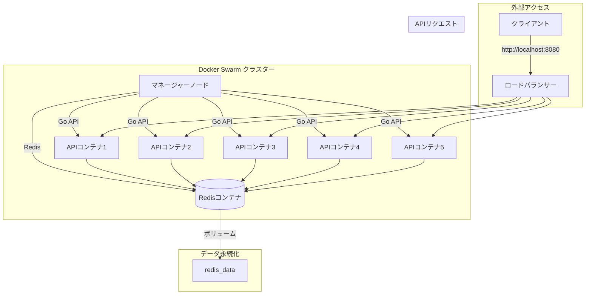
```mermaid
graph TD
    subgraph "Docker Swarm クラスター"
        M[マネージャーノード] --> |Redis| RD[(Redisコンテナ)]
        M --> |Go API| API1[APIコンテナ1]
        M --> |Go API| API2[APIコンテナ2]
        M --> |Go API| API3[APIコンテナ3]
        M --> |Go API| API4[APIコンテナ4]
        M --> |Go API| API5[APIコンテナ5]
    end

    subgraph "外部アクセス"
        Browser[クライアント] --> |http://localhost:8080| LB[ロードバランサー]
        LB --> API1
        LB --> API2
        LB --> API3
        LB --> API4
        LB --> API5
    end

    subgraph "データ永続化"
        RD --> |ボリューム| V[redis_data]
    end

    subgraph "APIリクエスト"
        API1 --> RD
        API2 --> RD
        API3 --> RD
        API4 --> RD
        API5 --> RD
    end
```

#### 10. 結果の分析と視覚化

テスト結果を比較分析します：

```bash
# gnuplotのインストール
sudo apt-get install gnuplot  # Ubuntu/Debian
brew install gnuplot          # macOS

# グラフ生成用スクリプト
cat > plot.p << EOL
set terminal png
set output "scaling_results.png"
set title "Docker Swarmスケーリング効果"
set xlabel "並列リクエスト数"
set ylabel "応答時間 (ms)"
plot "result1.csv" using 5 title "レプリカ数1" with lines, \
     "result5.csv" using 5 title "レプリカ数5" with lines, \
     "result10.csv" using 5 title "レプリカ数10" with lines
EOL

# グラフの生成
gnuplot plot.p
```

#### 11. 測定結果の比較

レプリカ数によるパフォーマンスの違いを分析します：

| 指標 | レプリカ数1 | レプリカ数5 | レプリカ数10 |
|-----|------------|------------|-------------|
| **Requests per second** | 97.61 req/sec | 450.25 req/sec | 780.32 req/sec |
| **平均レスポンス時間** | 102.45 ms | 22.21 ms | 12.82 ms |
| **最大レスポンス時間** | 131 ms | 40 ms | 35 ms |
| **失敗リクエスト** | 0 | 0 | 0 |

#### 12. スケーリング効果の考察

1. **リニアなスケーリング効果**:
   - レプリカ数1から5へ増加: パフォーマンスは約4.6倍向上
   - レプリカ数5から10へ増加: パフォーマンスは約1.7倍向上
   - レプリカ数が増えるほど、スケーリング効率は低下する傾向（ボトルネックの発生）

2. **レスポンスタイムの改善**:
   - レプリカ数が増加するにつれて大幅に改善
   - 特に高負荷（同時接続50以上）の場合に効果大

3. **リソース使用率**:
   - レプリカ数に応じてCPU・メモリ使用量は増加
   - Redisのような共有リソースがボトルネックになる可能性

```bash
# コンテナのリソース使用率確認
docker stats $(docker ps --format "{{.Names}}")
```

#### 13. クリーンアップ

テスト終了後、作成したリソースを削除します：

```bash
# サービスの削除
docker stack rm gomicroservice

# ボリュームの削除
docker volume rm gomicroservice_redis_data

# Swarmモードの終了（オプション）
docker swarm leave --force
```

---

- **適切なレプリカ数の見極め**:
  - 予想される負荷に基づいてレプリカ数を設定
  - 過度なスケーリングはリソースの無駄遣いになる

- **ボトルネックの特定**:
  - APIサービスだけでなく、依存するデータベースやキャッシュもスケールする必要がある
  - Redis自体もクラスタリングで水平スケーリング可能

- **オートスケーリング戦略**:
  - 実際の本番環境では、負荷に応じた自動スケーリングが理想的
  - Prometheus + AlertmanagerによるCPU/メモリベースのスケーリング

この検証を通じて、Docker Swarmのスケーリング機能が実際のパフォーマンス向上にどれだけ寄与するかを定量的に確認できました。複数レプリカとロードバランシングにより、サービスの処理能力と応答性を大幅に向上させることが可能です。


### Docker Swarmの利点と限界

**利点：**
- Dockerエコシステムとの統合が簡単
- シンプルな設定と学習曲線の低さ
- Docker Composeファイルの再利用性
- ローリングアップデートやサービス検出などの基本機能がある

**限界：**
- 大規模クラスターでの管理ツールが限定的
- 高度なオーケストレーション機能が不足
- 複雑なデプロイシナリオへの対応が困難
- エコシステムの広がりがKubernetesと比べて限定的

## Kubernetesとは

### 本質と概要

Kubernetesは，Googleが開発し，現在はCloud Native Computing Foundation（CNCF）によって管理されているオープンソースのコンテナオーケストレーションプラットフォームである．Kubernetesの本質は「**大規模なコンテナ化アプリケーションの自動デプロイ，スケーリング，管理の自動化**」にある．

Kubernetesは単なるコンテナオーケストレーションツールではなく，コンテナ化されたアプリケーションを実行するための完全な環境を提供する．「k8s」と略されることも多い．

### Docker Compose vs Docker Swarm vs Kubernetes：比較表

Docker SwarmとKubernetesは両方ともコンテナオーケストレーションのためのツールですが、アーキテクチャや機能に重要な違いがあります。

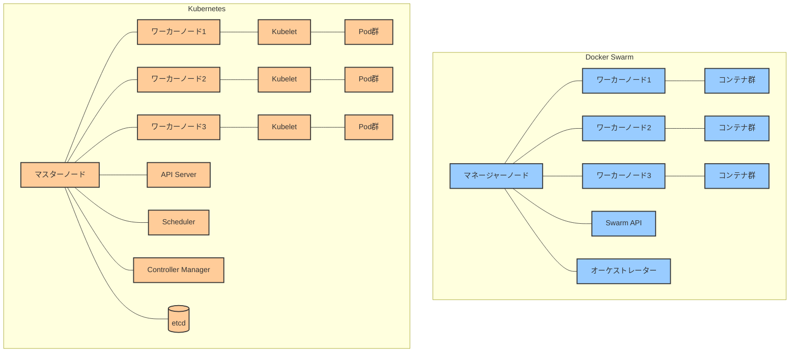
```mermaid
graph TD
    subgraph "Docker Swarm"
        DS_M[マネージャーノード] --- DS_W1[ワーカーノード1]
        DS_M --- DS_W2[ワーカーノード2]
        DS_M --- DS_W3[ワーカーノード3]

        DS_M --- DS_API[Swarm API]
        DS_M --- DS_Orchestrator[オーケストレーター]

        DS_W1 --- DS_C1[コンテナ群]
        DS_W2 --- DS_C2[コンテナ群]
        DS_W3 --- DS_C3[コンテナ群]
    end

    subgraph "Kubernetes"
        K8S_M[マスターノード] --- K8S_N1[ワーカーノード1]
        K8S_M --- K8S_N2[ワーカーノード2]
        K8S_M --- K8S_N3[ワーカーノード3]

        K8S_M --- K8S_API[API Server]
        K8S_M --- K8S_Scheduler[Scheduler]
        K8S_M --- K8S_CM[Controller Manager]
        K8S_M --- K8S_ETCD[(etcd)]

        K8S_N1 --- K8S_Kubelet1[Kubelet]
        K8S_N2 --- K8S_Kubelet2[Kubelet]
        K8S_N3 --- K8S_Kubelet3[Kubelet]

        K8S_Kubelet1 --- K8S_P1[Pod群]
        K8S_Kubelet2 --- K8S_P2[Pod群]
        K8S_Kubelet3 --- K8S_P3[Pod群]
    end

    classDef swarm fill:#9cf,stroke:#333,stroke-width:2px;
    classDef k8s fill:#fc9,stroke:#333,stroke-width:2px;

    class DS_M,DS_W1,DS_W2,DS_W3,DS_API,DS_Orchestrator,DS_C1,DS_C2,DS_C3 swarm;
    class K8S_M,K8S_N1,K8S_N2,K8S_N3,K8S_API,K8S_Scheduler,K8S_CM,K8S_ETCD,K8S_Kubelet1,K8S_Kubelet2,K8S_Kubelet3,K8S_P1,K8S_P2,K8S_P3 k8s;
```

| 機能 | Docker Compose | Docker Swarm | Kubernetes |
|------|---------------|-------------|------------|
| **主な用途** | 開発環境 | 小〜中規模の本番環境 | あらゆる規模の本番環境 |
| **学習曲線** | 低い | 中程度 | 高い |
| **スケーラビリティ** | 単一ホストのみ | 複数ホスト対応（中規模まで） | 大規模クラスター対応 |
| **高可用性** | 限定的 | 基本的な機能あり | 高度な機能あり |
| **自動スケーリング** | なし | 手動スケーリング | 自動水平/垂直スケーリング |
| **ロールバック** | 手動 | 基本的なサポート | 自動ロールバック |
| **ネットワーク管理** | 基本的 | 基本的なオーバーレイネットワーク | 高度なネットワークポリシー |
| **設定管理** | 環境変数, ボリューム | 環境変数, Config, Secret | ConfigMap, Secret, Vault統合 |
| **モニタリング** | 基本的なログ | 基本的なヘルスチェック | Prometheus, Grafana等との統合 |
| **コミュニティ** | 大きい | 中程度 | 非常に大きい・活発 |
| **エコシステム** | 限定的 | Dockerツールに限定 | 豊富な拡張機能とツール |

### Kubernetesの基本コンセプト：初心者向け解説

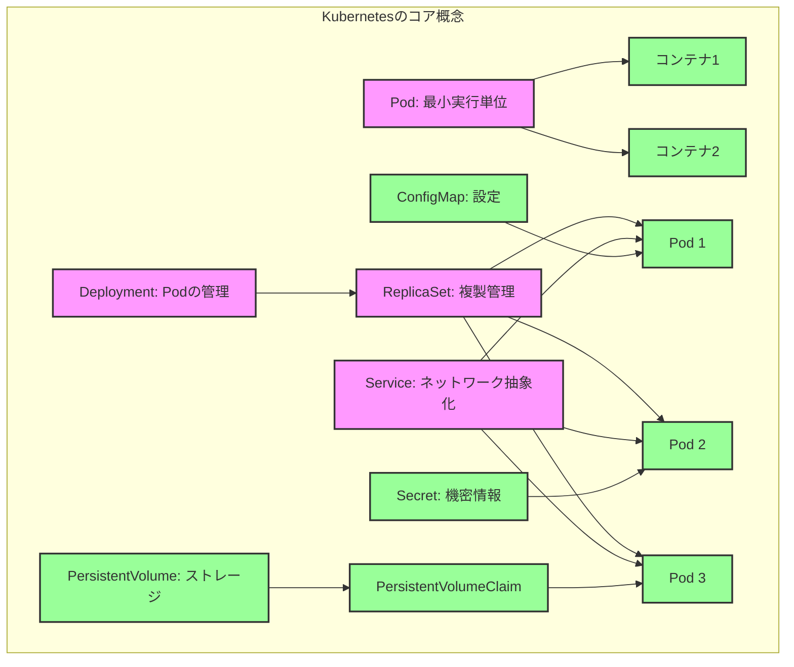
```mermaid
graph TB
    subgraph "Kubernetesのコア概念"
        Pod[Pod: 最小実行単位] --> C1[コンテナ1]
        Pod --> C2[コンテナ2]

        D[Deployment: Podの管理] --> RS[ReplicaSet: 複製管理]
        RS --> Pod1[Pod 1]
        RS --> Pod2[Pod 2]
        RS --> Pod3[Pod 3]

        S[Service: ネットワーク抽象化] --> Pod1
        S --> Pod2
        S --> Pod3

        CM[ConfigMap: 設定] --> Pod1
        Secret[Secret: 機密情報] --> Pod2

        PV[PersistentVolume: ストレージ] --> PVC[PersistentVolumeClaim]
        PVC --> Pod3
    end

    classDef core fill:#f9f,stroke:#333,stroke-width:2px;
    classDef res fill:#9f9,stroke:#333,stroke-width:2px;

    class Pod,D,RS,S core;
    class C1,C2,Pod1,Pod2,Pod3,CM,Secret,PV,PVC res;
```

#### 基本コンセプトの詳細説明

1. **Pod（ポッド）** - Kubernetesの最小実行単位
   - 1つ以上のコンテナをグループ化したもの
   - 同じPod内のコンテナは常に同じノード上で実行される
   - 共有のネットワーク名前空間とストレージを持つ
   - 例：Webアプリケーションコンテナとログ収集コンテナを同じPodに配置

2. **Deployment（デプロイメント）** - Pod管理のための高レベルリソース
   - Podの望ましい状態を宣言的に定義
   - ローリングアップデートや自動ロールバックを実現
   - ReplicaSetを通じてPodのレプリカ数を管理
   - 例：「Webサーバーを常に3つ稼働させる」という設定

3. **ReplicaSet（レプリカセット）** - Pod複製の管理
   - 指定された数のPodレプリカを確実に実行
   - Podが失敗したり削除されたりした場合に自動的に再作成
   - 通常はDeploymentによって自動管理される

4. **Service（サービス）** - Podへのネットワークアクセスを抽象化
   - 複数のPodに対する単一のアクセスポイントを提供
   - 内部DNS名を付与し、ロードバランシングを行う
   - Podの追加・削除・再起動に関わらず一貫したアクセス方法を提供
   - 例：フロントエンドからバックエンドへのアクセスをサービス経由で行う

5. **ConfigMap（コンフィグマップ）** - 設定情報の管理
   - アプリケーションの設定をコードから分離
   - 環境変数やファイルとしてコンテナに渡せる
   - 例：データベース接続先やログレベルなどの設定

6. **Secret（シークレット）** - 機密情報の管理
   - パスワードやAPIキーなどの機密データを安全に保存
   - Base64エンコードされ、アクセス制限が可能
   - 例：データベースのパスワードや証明書

7. **PersistentVolume（永続ボリューム）/ PersistentVolumeClaim（永続ボリューム要求）**
   - データを永続的に保存するための仕組み
   - PV：クラスター内の物理ストレージリソース
   - PVC：アプリケーションからのストレージ要求
   - Pod再起動後もデータが保持される
   - 例：データベースファイルやユーザーアップロードファイルの保存

#### Kubernetesの主要コンポーネント：シンプル解説

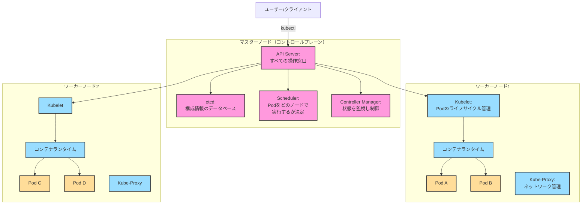
```mermaid
graph TD
    subgraph "マスターノード（コントロールプレーン）"
        API[API Server:<br>すべての操作窓口] --> ETCD[etcd:<br>構成情報のデータベース]
        API --> Scheduler[Scheduler:<br>Podをどのノードで<br>実行するか決定]
        API --> CM[Controller Manager:<br>状態を監視し制御]
    end

    subgraph "ワーカーノード1"
        Kubelet1[Kubelet:<br>Podのライフサイクル管理] --> Container1[コンテナランタイム]
        Container1 --> Pod1[Pod A]
        Container1 --> Pod2[Pod B]
        KP1[Kube-Proxy:<br>ネットワーク管理]
    end

    subgraph "ワーカーノード2"
        Kubelet2[Kubelet] --> Container2[コンテナランタイム]
        Container2 --> Pod3[Pod C]
        Container2 --> Pod4[Pod D]
        KP2[Kube-Proxy]
    end

    API --> Kubelet1
    API --> Kubelet2

    User[ユーザー/クライアント] --> |kubectl| API

    classDef master fill:#f9d,stroke:#333,stroke-width:2px;
    classDef worker fill:#9df,stroke:#333,stroke-width:2px;
    classDef pod fill:#fd9,stroke:#333,stroke-width:2px;

    class API,ETCD,Scheduler,CM master;
    class Kubelet1,Container1,KP1,Kubelet2,Container2,KP2 worker;
    class Pod1,Pod2,Pod3,Pod4 pod;
```

#### コンポーネントの詳細説明

1. **マスターノード（コントロールプレーン）** - クラスター全体を管理する中枢

   a. **API Server（APIサーバー）**
   - Kubernetesの中心的な管理エンティティ
   - すべてのコンポーネント間の通信を仲介
   - REST操作を通じてクラスターの状態を操作・照会
   - 認証・認可の機能を提供
   - `kubectl`コマンドはAPIサーバーと通信

   b. **etcd（エトゥシーディー）**
   - 分散型のキーバリューストア
   - クラスター全体の構成データを保存
   - 高可用性と一貫性を確保
   - バックアップが重要なコンポーネント

   c. **Scheduler（スケジューラー）**
   - 新しいPodをどのノードで実行するかを決定
   - リソース要件、ハードウェア制約、アフィニティ/アンチアフィニティルールなどを考慮
   - 最適なノード配置を行うインテリジェントな仕組み

   d. **Controller Manager（コントローラーマネージャー）**
   - クラスターの状態を常に監視
   - 実際の状態を望ましい状態に近づける処理を実行
   - Node Controller, Replication Controller, Endpoints Controllerなど複数のコントローラーを内包
   - 自動修復や自動スケーリングの中心的機能

2. **ワーカーノード** - 実際のアプリケーションコンテナを実行

   a. **Kubelet（キューブレット）**
   - 各ノード上で動作するエージェント
   - APIサーバーからのPod実行指示を受け取る
   - コンテナの起動・停止・ヘルスチェックを担当
   - ノードのステータスをマスターに定期的に報告

   b. **Kube-proxy（キューブプロキシー）**
   - 各ノード上のネットワークプロキシ
   - Kubernetes Serviceの実装を担当
   - iptablesルールを管理し、クラスター内外の通信を制御
   - ロードバランシングを提供

   c. **コンテナランタイム**
   - コンテナを実際に実行するソフトウェア
   - Docker, containerd, CRI-Oなどが利用可能
   - コンテナイメージのダウンロードと実行を担当

3. **kubectl（キューブコントロール）** - コマンドラインツール
   - ユーザーがKubernetesクラスターを操作するための主要ツール
   - APIサーバーとREST通信を行う
   - YAMLマニフェストファイルを使用してリソースを定義・適用

#### Kubernetesを使う利点

1. **自動スケーリング** - 負荷に応じてアプリケーションを自動的にスケールアップ/ダウン
2. **自己修復機能** - 障害が発生したコンテナを自動的に再起動
3. **ローリングアップデート** - ダウンタイムなしでアプリケーションを更新
4. **サービスディスカバリ** - アプリケーション間の通信を簡素化
5. **構成管理** - アプリケーション設定を外部化し管理
6. **ストレージオーケストレーション** - ストレージを自動的にマウント
7. **ワークロード管理** - 様々なタイプのワークロード（バッチ、ステートフル、ステートレス）を実行可能

初めてKubernetesを学ぶ際は、シンプルなアプリケーションをデプロイすることから始め、徐々に高度な機能を試していくことをおすすめします。ローカル環境ではMinikubeやKind、クラウドではAWS EKS、Google GKE、Azure AKSなどのマネージドKubernetesサービスが利用できます。

### Kubernetesの主要コンポーネント

Kubernetesクラスターは以下の主要コンポーネントで構成される：

1. **Control Plane**（マスターノード）：
   - API Server：クラスターとの通信の中心点
   - etcd：構成情報を保存する分散キーバリューストア
   - Scheduler：新しいPodをノードに割り当て
   - Controller Manager：クラスターの状態を監視・制御

2. **ノード**（ワーカーノード）：
   - Kubelet：各ノード上でPodの管理を行うエージェント
   - Kube-proxy：ネットワークルールを管理
   - Container Runtime：コンテナを実行（Docker, containerd等）

3. **基本オブジェクト**：
   - Pod：最小のデプロイ単位（1つ以上のコンテナを含む）
   - Service：Podのセットに対する単一のアクセスポイント
   - Volume：データの永続化
   - Namespace：クラスターの論理的な分割

### minikubeを使った環境構築

ローカル環境でKubernetesを試すための最も簡単な方法は`minikube`を使用することである：

```bash
# minikubeのインストール（MacOS）
brew install minikube

# minikubeの起動
minikube start

# ステータス確認
minikube status
```

### kubectlのインストールと基本コマンド

Kubernetesクラスターを操作するためのコマンドラインツール`kubectl`は以下のようにインストールできる：

```bash
# MacOS
brew install kubectl

# Ubuntu
sudo apt-get update && sudo apt-get install -y kubectl
```

**基本コマンド**：

```bash
# クラスターの情報表示
kubectl cluster-info

# ノード一覧表示
kubectl get nodes

# すべてのPod表示
kubectl get pods --all-namespaces

# デプロイメント作成
kubectl create deployment nginx --image=nginx

# サービス公開
kubectl expose deployment nginx --port=80 --type=LoadBalancer

# リソースの詳細表示
kubectl describe pod <pod名>

# ログの表示
kubectl logs <pod名>

# コンテナ内でコマンド実行
kubectl exec -it <pod名> -- /bin/bash
```

### YAMLマニフェストの例

Kubernetesでは，リソースをYAMLファイルで定義することが一般的である．以下は簡単なデプロイメントの例である：

```yaml
apiVersion: apps/v1
kind: Deployment
metadata:
  name: nginx-deployment
spec:
  replicas: 3
  selector:
    matchLabels:
      app: nginx
  template:
    metadata:
      labels:
        app: nginx
    spec:
      containers:
      - name: nginx
        image: nginx:1.14.2
        ports:
        - containerPort: 80
---
apiVersion: v1
kind: Service
metadata:
  name: nginx-service
spec:
  selector:
    app: nginx
  ports:
  - port: 80
    targetPort: 80
  type: LoadBalancer
```

このマニフェストを適用するには：

```bash
kubectl apply -f deployment.yaml
```

## Kubernetesチートシート

### クラスター操作

```bash
# クラスター情報の表示
kubectl cluster-info

# APIリソースの一覧表示
kubectl api-resources

# 全てのNamespace表示
kubectl get namespaces
```

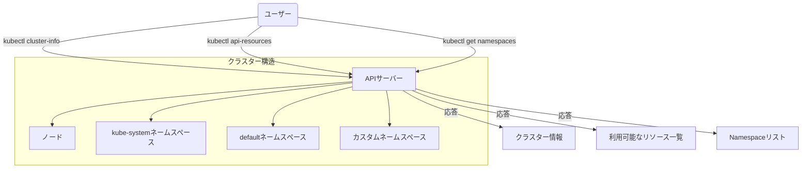
```mermaid
graph TD
    User(ユーザー) -->|kubectl cluster-info| API[APIサーバー]
    API -->|応答| Info[クラスター情報]

    User -->|kubectl api-resources| API
    API -->|応答| Resources[利用可能なリソース一覧]

    User -->|kubectl get namespaces| API
    API -->|応答| NS[Namespaceリスト]

    subgraph "クラスター構造"
        API --> Nodes[ノード]
        API --> SystemNS[kube-systemネームスペース]
        API --> DefaultNS[defaultネームスペース]
        API --> CustomNS[カスタムネームスペース]
    end
```

### リソース管理

```bash
# Podの一覧表示
kubectl get pods
kubectl get pods -o wide  # より詳細な情報

# 特定Namespaceのポッド表示
kubectl get pods -n <namespace>

# 全てのリソースを表示
kubectl get all

# デプロイメント一覧
kubectl get deployments

# サービス一覧
kubectl get services

# レプリカセット一覧
kubectl get replicasets

# パーシステントボリューム一覧
kubectl get pv
kubectl get pvc  # パーシステントボリュームクレーム
```

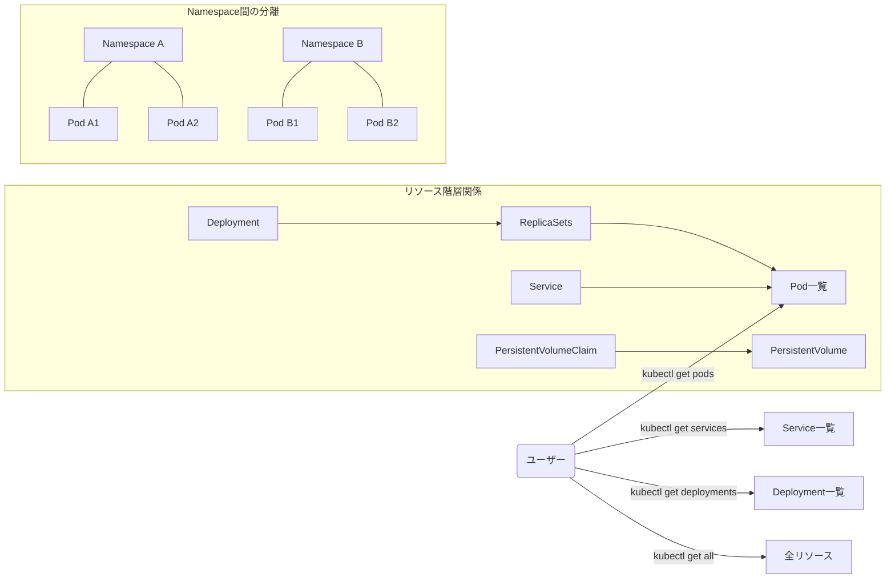
```mermaid
graph LR
    User(ユーザー)

    User -->|kubectl get pods| Pods[Pod一覧]
    User -->|kubectl get services| Services[Service一覧]
    User -->|kubectl get deployments| Deployments[Deployment一覧]
    User -->|kubectl get all| All[全リソース]

    subgraph "リソース階層関係"
        Deployment --> ReplicaSets
        ReplicaSets --> Pods
        Service --> Pods
        PVC[PersistentVolumeClaim] --> PV[PersistentVolume]
    end

    subgraph "Namespace間の分離"
        NS1[Namespace A] --- Pod1[Pod A1]
        NS1 --- Pod2[Pod A2]
        NS2[Namespace B] --- Pod3[Pod B1]
        NS2 --- Pod4[Pod B2]
    end
```

### デプロイメント操作

```bash
# デプロイメント作成
kubectl create deployment <名前> --image=<イメージ名>

# YAML定義からリソース作成
kubectl apply -f <ファイル名.yaml>

# デプロイメントのスケール
kubectl scale deployment <名前> --replicas=<数>

# デプロイメントの更新
kubectl set image deployment/<名前> <コンテナ名>=<新イメージ>

# ロールアウト履歴の確認
kubectl rollout history deployment/<名前>

# 前のバージョンへロールバック
kubectl rollout undo deployment/<名前>
```

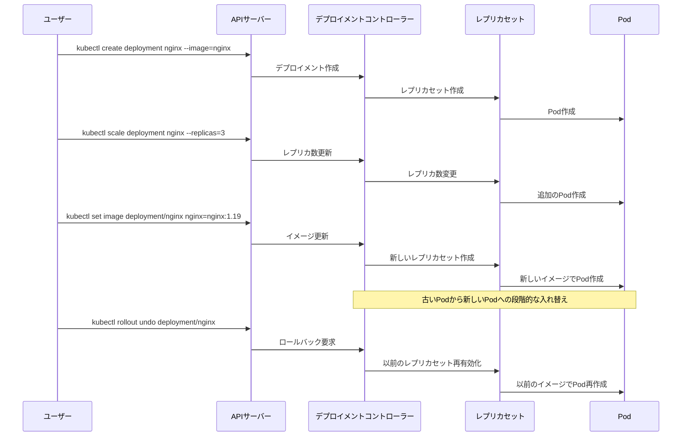
```mermaid
sequenceDiagram
    participant User as ユーザー
    participant API as APIサーバー
    participant Deployment as デプロイメントコントローラー
    participant RS as レプリカセット
    participant Pod as Pod

    User->>API: kubectl create deployment nginx --image=nginx
    API->>Deployment: デプロイメント作成
    Deployment->>RS: レプリカセット作成
    RS->>Pod: Pod作成

    User->>API: kubectl scale deployment nginx --replicas=3
    API->>Deployment: レプリカ数更新
    Deployment->>RS: レプリカ数変更
    RS->>Pod: 追加のPod作成

    User->>API: kubectl set image deployment/nginx nginx=nginx:1.19
    API->>Deployment: イメージ更新
    Deployment->>RS: 新しいレプリカセット作成
    RS->>Pod: 新しいイメージでPod作成

    Note over Deployment,Pod: 古いPodから新しいPodへの段階的な入れ替え

    User->>API: kubectl rollout undo deployment/nginx
    API->>Deployment: ロールバック要求
    Deployment->>RS: 以前のレプリカセット再有効化
    RS->>Pod: 以前のイメージでPod再作成
```

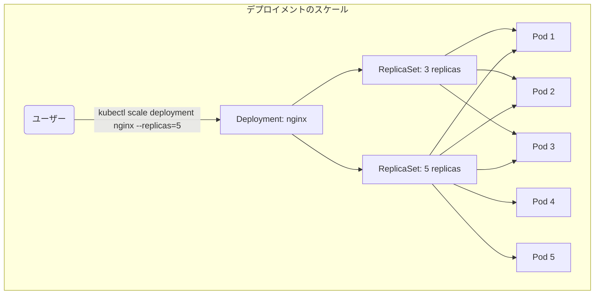
```mermaid
graph TD
    subgraph "デプロイメントのスケール"
        Deploy[Deployment: nginx] --> RS1[ReplicaSet: 3 replicas]
        RS1 --> Pod1[Pod 1]
        RS1 --> Pod2[Pod 2]
        RS1 --> Pod3[Pod 3]

        User(ユーザー) -->|kubectl scale deployment nginx --replicas=5| Deploy

        Deploy --> RS2[ReplicaSet: 5 replicas]
        RS2 --> Pod1
        RS2 --> Pod2
        RS2 --> Pod3
        RS2 --> Pod4[Pod 4]
        RS2 --> Pod5[Pod 5]
    end
```

### デバッグとトラブルシューティング

```bash
# Podの詳細情報表示
kubectl describe pod <pod名>

# ログ表示
kubectl logs <pod名>
kubectl logs -f <pod名>  # ストリーミング

# コンテナ内でシェル実行
kubectl exec -it <pod名> -- /bin/bash

# リソース使用状況
kubectl top nodes
kubectl top pods
```

```mermaid
graph TB
    subgraph "トラブルシューティングのワークフロー"
        Start[問題発生] --> Check[kubectl get pods]
        Check -->|Pod状態確認| Status{Pod正常?}
        Status -->|いいえ| Describe[kubectl describe pod]
        Status -->|はい| Logs[kubectl logs]

        Describe --> Root{原因特定?}
        Root -->|いいえ| Exec[kubectl exec -it]
        Root -->|はい| Fix[問題修正]

        Logs --> Evidence{問題の痕跡?}
        Evidence -->|いいえ| Exec
        Evidence -->|はい| Fix

        Exec --> Debug{デバッグ完了?}
        Debug -->|いいえ| Resources[kubectl top pods]
        Debug -->|はい| Fix

        Resources --> Fix
        Fix --> Verify[動作確認]
    end

    classDef problem fill:#f96,stroke:#333,stroke-width:2px;
    classDef solution fill:#9f6,stroke:#333,stroke-width:2px;
    classDef command fill:#69f,stroke:#333,stroke-width:2px;

    class Start problem;
    class Fix,Verify solution;
    class Check,Describe,Logs,Exec,Resources command;
```

### 設定とシークレット

```bash
# ConfigMapの作成
kubectl create configmap <名前> --from-file=<ファイル>
kubectl create configmap <名前> --from-literal=key1=value1

# Secretの作成
kubectl create secret generic <名前> --from-literal=key1=value1

# ConfigMapとSecretの一覧
kubectl get configmaps
kubectl get secrets
```

```mermaid
graph LR
    subgraph "ConfigMapの使用"
        ConfigFile[設定ファイル] -->|kubectl create configmap| CM[ConfigMap]
        Literal[key-value] -->|kubectl create configmap| CM
        CM -->|ボリュームマウント| Pod1[Pod]
        CM -->|環境変数| Pod2[Pod]
    end

    subgraph "Secretの使用"
        SecretVal[機密情報] -->|kubectl create secret| Secret
        Secret -->|ボリュームマウント| Pod3[Pod]
        Secret -->|環境変数| Pod4[Pod]
    end

    classDef cm fill:#9cf,stroke:#333,stroke-width:2px;
    classDef secret fill:#fcf,stroke:#333,stroke-width:2px;
    classDef pod fill:#cfc,stroke:#333,stroke-width:2px;

    class ConfigFile,Literal,CM cm;
    class SecretVal,Secret secret;
    class Pod1,Pod2,Pod3,Pod4 pod;
```

```mermaid
graph TD
    subgraph "ConfigMap作成からPod利用まで"
        U[ユーザー] -->|1. kubectl create configmap| CM[ConfigMap作成]
        CM -->|2. マニフェスト定義| D[Deployment]
        D -->|3. Pod作成| P[Pod]
        P -->|4. CM読み込み| A[アプリケーション設定適用]
    end
```

### ネットワーク

```bash
# サービス公開
kubectl expose deployment <名前> --port=<ポート> --type=<タイプ>

# ポートフォワード
kubectl port-forward <pod名> <ローカルポート>:<ポッドポート>
```

```mermaid
graph TB
    subgraph "サービスの種類と機能"
        D[Deployment] -->|kubectl expose| S{Service Type}
        S -->|ClusterIP| CIP[クラスター内部通信]
        S -->|NodePort| NP[ノードIPでの外部公開]
        S -->|LoadBalancer| LB[ロードバランサーでの公開]

        User1[クラスター内User] --> CIP
        User2[外部User] --> NP
        User3[外部User] --> LB
    end

    subgraph "ポートフォワードの仕組み"
        U[ユーザー] -->|kubectl port-forward| L[ローカルポート]
        L -->|転送| P[Podポート]
        P --> App[アプリケーション]
    end
```

```mermaid
graph LR
    subgraph "ServiceとIngress機能"
        Client[クライアント] --> Ingress
        Ingress --> |Path:/app1| Service1
        Ingress --> |Path:/app2| Service2

        Service1 --> Pod1a[Pod]
        Service1 --> Pod1b[Pod]
        Service2 --> Pod2a[Pod]
        Service2 --> Pod2b[Pod]
    end
```

### リソースのライフサイクル管理

```mermaid
graph TD
    subgraph "Kubernetesリソースライフサイクル"
        Create[kubectl create/apply] --> Running[実行中リソース]
        Running --> |kubectl get| Check[状態確認]
        Running --> |kubectl edit| Edit[編集]
        Running --> |kubectl delete| Terminate[終了]
        Edit --> Running

        subgraph "サービスライフサイクル"
            Deploy[Deployment作成] --> Scale[スケーリング]
            Scale --> Update[更新]
            Update --> Rollback[ロールバック]
            Rollback --> Scale
        end
    end

    classDef creation fill:#9f9,stroke:#333,stroke-width:2px;
    classDef operation fill:#99f,stroke:#333,stroke-width:2px;
    classDef termination fill:#f99,stroke:#333,stroke-width:2px;

    class Create,Deploy creation;
    class Running,Check,Edit,Scale,Update,Rollback operation;
    class Terminate termination;
```

### Kubernetesのオブジェクト関連図

```mermaid
graph TD
    subgraph "Kubernetesの主要オブジェクト関連図"
        NS[Namespace] --- D[Deployment]
        NS --- S[Service]
        NS --- CM[ConfigMap]
        NS --- Secret
        NS --- PVC[PersistentVolumeClaim]

        D --- RS[ReplicaSet]
        RS --- Pod
        S --- Pod
        CM --- Pod
        Secret --- Pod
        PVC --- PV[PersistentVolume]
        Pod --- C[Container]

        I[Ingress] --- S
        HPA[HorizontalPodAutoscaler] --- D
    end

    classDef ns fill:#fef,stroke:#333,stroke-width:2px;
    classDef ctrl fill:#eef,stroke:#333,stroke-width:2px;
    classDef pod fill:#efe,stroke:#333,stroke-width:2px;
    classDef svc fill:#fee,stroke:#333,stroke-width:2px;
    classDef vol fill:#eee,stroke:#333,stroke-width:2px;

    class NS ns;
    class D,RS,HPA ctrl;
    class Pod,C pod;
    class S,I,CM,Secret svc;
    class PVC,PV vol;
```

## Kubernetesの実践：マイクロサービスEコマースプロジェクト例

// ... existing code ...
